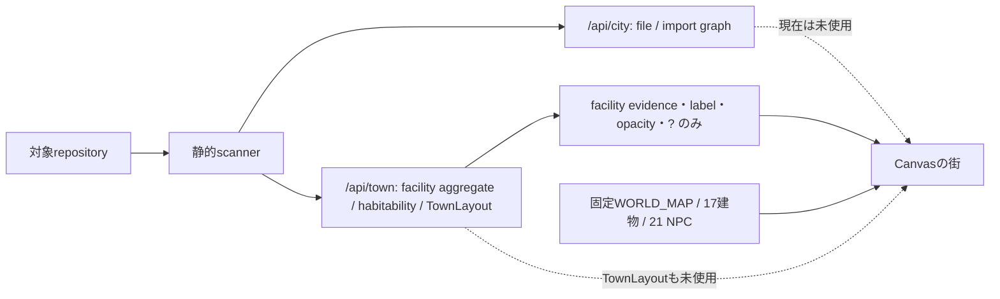
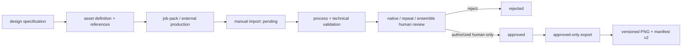

# CodeCity Inspector — Fable5向けゲームデザイン引き継ぎ

- 作成日: 2026-07-15
- 監査対象: `23b021a` (`feat: complete playable CodeCity inspection loop`)
- 状態: **技術検証済みプロトタイプ／ゲームデザイン審査不合格／再設計待ち**

## 0. この文書の目的と権限

この文書は、Fable5が**ゲームデザインだけ**を行うための引き継ぎ資料である。
現行実装を正当化する資料でも、完成報告でもない。

現行ビルドは、静的検査結果を安全に読み、Canvasの街で移動・施設入退場・
根拠表示を行う技術基盤までは持つ。しかし、ユーザーからの
「歩けるようになっただけ」という評価はコード構造とも一致している。
以前の「完成候補」という判定は撤回し、Fable5の設計を経るまで再使用しない。

Fable5には、現行の32×24マップ、4地区、道場→住宅の旅程、17サイト、HUDを
設計上の前提として固定しない。これらは変更可能な実装詳細である。一方、
読み取り専用、安全性、証拠区分、決定性、人間承認などの境界は維持する。

Fable5はコード変更、画像生成、素材承認、exportを行わない。設計案の各項目に、
次のlabelを1個以上付記すること。複数labelの併記を前提とする。

- `STACK-COMPATIBLE`: 新しい基盤、API、data model、asset contractを増やさず実装可能。
  frontend編集を伴う場合は`RENDERER-CHANGE`も併記する
- `RENDERER-CHANGE`: Canvasのworld/site/UI実装変更が必要
- `MODEL-CHANGE`: scanner、TownModel、TownLayout、APIの変更が必要
- `ASSET-CHANGE`: 素材の追加・再制作・契約変更が必要
- `SCOPE-DECISION`: プロジェクト所有者の判断が必要
- `SECURITY-CONFLICT`: 現行の安全境界と両立しないため、そのまま採用不可

### 0.1 素材について確定した前提

プロジェクト所有者は、**現行78素材では完成に全く足りず、現行実装での使い方も悪い**
と判定している。これはFable5が再評価して覆す未確認事項ではなく、設計の出発点である。

- 78件がmanifest上で揃っていることは、必要な素材語彙が揃ったことを意味しない。
- 地形のedge/corner/transition、非反復variant、建物状態、地区差、人物の調査・反応、
  UI、必要ならinteriorなどが大幅に不足している。
- 現行の固定配置、同一tileのflip/rotation反復、静止NPC、素材ID網羅を優先した配置、
  opacityと`?`への依存は、素材の意味を活かす使い方になっていない。
- Fable5は「78点を並べ直せば完成する」と仮定せず、必要量とasset familyから設計する。

現在の完成条件には「承認済み78素材だけを使用し、全78を意味ある形で使う」とある一方、
所有者はその集合が不足していると確定した。Fable5はremake/add/retireを設計提案し、
所有者が新しい必須集合と移行条件を明示承認する。承認前に実装側が勝手に78-only gateを
変更してはならない。承認後は「変更後のapproved required setのみ使用し、その必須集合を
意味ある形で使う」を新しいgateとする。

### 0.2 役割と承認権限

| 役割 | 責任 | 行わないこと |
| --- | --- | --- |
| Fable5 | design-only成果物、代替案、変更label、受入条件を提出 | code変更、画像制作、promotion、scope確定 |
| プロジェクト所有者 | product promise、scope、素材方針、設計、実機での最終完成を承認 | テスト成功だけで完成扱いしない |
| Lead `/root` | 技術適合性判断、作業分解、統合、検証、commit | 所有者に代わるgame design承認 |
| Terra | Lead配下の実装・監査worker。今回は現行runtimeをread-only監査 | 独断のproduct decision、commit、push |
| 独立reviewer | distribution/security変更を実装担当と別にread-only review | 実装と自己承認の兼任 |

完成までのgateは、設計承認、vertical slice、**内容を知らない真の初見ユーザーによる
説明なしplaytest**、技術テスト、プロジェクト所有者の実機・視覚審査、同所有者の
明示承認を別々に扱う。所有者の審査を初見playtestの代わりにしない。

## 1. 一文で表すプロダクトの約束

> 自分のリポジトリが構造と状態を持つ一つの街として立ち上がり、歩く・発見する・
> 訪ねるという行為を通して、コードの仕組みと不確実性を直感的に理解できる。

これは「ピクセルアートの街を歩ける」こととは異なる。初回体験後、ユーザーが
「歩けた」ではなく、**「このリポジトリについて一つ具体的なことが分かった」**
と言えることが最低条件である。

## 2. エンドユーザーへ届けたい価値

### 2.1 中核価値

1. **自分の街であること**
   開いたリポジトリ固有のファイル、接続、入口、状態が街の地理や住民へ反映され、
   別のリポジトリとは見分けられる。

2. **空間で理解できること**
   一覧やスコアを読むより低い認知負荷で、主要構成、依存、入口、保存、テスト、
   監視、配布、外部接続の関係をつかめる。

3. **歩行が調査になること**
   移動はdrawerが開くまでの待ち時間ではない。道、封鎖、灯り、煙、NPC、
   建物の変化から手掛かりを得て、次に何を調べるか選ぶ行為である。

4. **不確実性を誠実に扱うこと**
   観測、推測、未確認を混ぜず、未テストや未解析を故障と呼ばない。詳細から
   ファイルや接続という根拠へ戻れる。

5. **安全に試せること**
   対象コードを実行・変更・uploadせず、Mac内のloopbackだけで探索できる。

### 2.2 主なJobs to be Done

- 初見のリポジトリの入口と主要な構成を短時間で把握する。
- 外部接続、テスト、保存、設定、監視、配布経路の有無と根拠を調べる。
- ファイル間の接続、循環、未解決import、到達性、テスト対応を発見する。
- 「無い」「観測できない」「推測しかない」「実行しないと分からない」を区別する。
- 気になる場所から、次に読むべきファイルや接続を判断する。
- 同じ入力は同じ街として認識し、コード変更後には意味のある差を発見する。

最後の2項目は有力な価値仮説であり、現行の完成条件には十分定義されていない。
Fable5が採否と具体的な体験を設計すること。

## 3. ユーザー完成条件に対する現在地

| 領域 | 現在の観測 | 正しい判定 | Fable5が設計すべきこと |
| --- | --- | --- | --- |
| 起動直後 | 初期ロード後は街・player・操作案内を表示する。78画像の全読込を待つ | 基本画面は実装済み。5秒保証と初見理解は未検証 | 5秒以内に「自分のコードの街」と理解できるload設計と視線誘導 |
| 街の成立 | 固定4地区と連結歩行グラフがある | 構造テスト済み、世界設計は未達 | 地区の必然性、地理、ランドマーク、入口、見通し |
| イメージボード品質 | 78素材は詳細だが、固定タイル反復・地区の継ぎ目・非整数拡大がある | 不合格 | 画面構図、密度、縮尺、接地、陰影、奥行きのmaster design |
| ゲームの一周 | 道場→根拠→住宅まで操作可能 | 操作シーケンスのみ。遊びとして未達 | 発見、選択、施設固有の調査、理解の獲得とfeedback |
| CodeCityとしての意味 | facilityの証拠は表示する | 部分実装。街の地理はrepo固有でない | ファイル・import・状態を空間、住民、現象へ対応させる文法 |
| 素材 | 公開PNGとmanifestは正確に78件、参照ID監査も78件 | **量も種類も不足し、現行の使い方も不合格**。技術網羅だけ成功 | 必要なasset family、keep/remake/add/retire、新必須集合、各素材のゲーム上の役割 |
| 操作・安定性 | keyboard/click/path/cameraは存在する | 基本動作あり。入力感、mobile、移動cancelに欠陥 | 操作モデル、touch、feedback、camera、collisionの体感仕様 |
| 完成判定 | 対象commitでは213 root testsとAsset Forge来歴テストの成功記録がある | **テスト成功のみ**。完成候補判定は撤回 | 初見playtestと所有者の視覚審査を通す設計受入条件 |

## 4. 現在の技術スタック

### 4.1 全体構成

| 層 | 技術 | 現在できること | 主な制約 |
| --- | --- | --- | --- |
| Repository scan | Node.js 20、`@babel/parser` | JS/TSを静的に読み、ファイル、literal import、入口、循環、テスト対応、到達性をモデル化 | runtime、dynamic path、bundler alias、外部サービスは完全には分からない |
| Town domain | Pure ESM modules | 14施設、habitability Lv.0–5、証拠3区分、決定論的TownLayout、空間validator | 現在のゲームfrontendはTownLayoutを使っていない |
| Local server | Node `http` | `/api/city`、`/api/town`、静的game assetsを配信 | `127.0.0.1`限定、GET/HEAD限定、保存APIなし |
| Game frontend | Vanilla HTML/CSS/ES modules、Canvas 2D | world/site描画、keyboard/click移動、path、camera、施設入退場、drawer | framework/bundlerなし、固定データ中心、audio/dialogue/saveなし |
| Art pipeline | Asset Forge、Ajv、Sharp | 定義、job pack、manual import、加工、検証、人間承認、approved-only export | 自動art directionなし、CLI単体で本番画像を生成しない |
| Tests | Node test runner | scanner、model、layout、server、manifest、asset usage、navigationの構造検証 | 面白さ、初見理解、視覚品質、「意味ある使用」は証明しない |

### 4.2 Scannerとinspection model

対象拡張子は `.js`、`.jsx`、`.mjs`、`.cjs`、`.ts`、`.tsx`、`.mts`、`.cts`。
文字列literalのimport/export/require/import()をBabel ASTで読む。既定上限は次の通り。

| 上限 | 値 |
| --- | ---: |
| directory | 10,000 |
| directory entry | 100,000 |
| source file | 2,500 |
| total bytes | 12 MiB |
| one file | 2 MiB |
| AST nodes | 1,000,000 |
| dependency edges | 25,000 |

`/api/city`には、ファイル単位のbuilding model、resolved/unresolved/unknown edge、
cycle、test association、entrypoint、reachabilityがある。ソース本文は返さない。

`/api/town`には、14施設、habitability、決定論的TownLayoutとvalidationがある。
同じinspection、generator version、seedから同じlayoutを再生成できる。ただし現行
TownLayoutが置くのはpresentな施設kindごとの集約建物であり、file 1件ごとの建物や
import edgeごとの道路ではない。TownLayoutだけをfrontendへ描いても、製品約束の
「ファイルが建物、importが道」は達成しない。その約束を維持するなら`/api/city`を
使うか、明示した集約規則をTownModel/TownLayoutへ追加する`MODEL-CHANGE`が必要である。

### 4.3 14施設が現在実際に読むsignal

施設名の比喩を、scannerが現在観測できる能力と混同しないこと。

| 施設 | 現行detectorが読むsignal | 読まない／証明しないこと |
| --- | --- | --- |
| 門 `gate` | `package.json`のmain/module/bin/exportsがscanned fileへ解決する入口 | 実際に起動するか |
| 役場 `town_hall` | repository名、discovered/scanned file数、供給された外部contractor report数 | git履歴、issue、releaseは読まない。reportの自己申告を成功事実にしない |
| 接続者ギルド `guild` | LLM SDK、external-service dependency、route-like file、webhook hintのroster | 実接続、認証、費用制御 |
| 宿屋 `inn` | web-server dependency、server/api/routes path由来のservice file | deploy、起動、到達可能性 |
| 酒場 `pub` | LLM SDK、external-service dependency、API route/handler、webhook hint | request成功、rate/cost limit |
| 商店 `shop` | interface/UI-facingに分類されたfile | 一般package、feature全般、商用性 |
| 船着場 `dock` | React Native/Expo、Electron、`bin` field、非private package | build、署名、publish、deploy成功 |
| 倉庫 `warehouse` | DB/storage dependency、data/model/dbに分類されたfile | connection、provisioning、schema、保存data |
| 井戸 `well` | `.env`形fileの存在、dotenv dependency、configuration file | secret値、必要envの充足 |
| 工房 `workshop` | `build` scriptの宣言、CI configurationの存在 | local run、build/CI成功。対象scriptは実行しない |
| 道場 `dojo` | test file、`test` script、静的に推測したsource/test association | test成功。対象testは実行しない |
| 見張り台 `watchtower` | logging/monitoring dependency | log/alertが実際に動くか、保存先 |
| 住宅 `house` | `module` kindに分類された通常file | feature/componentというproduct意味を自動理解すること |
| 廃屋 `ruin` | test対応なし、かつ既知entrypointから未到達のfileという推測 | dead/legacy/brokenの断定 |

### 4.4 現在のCanvas runtime

観測できる固定contentは次の通り。

| 項目 | 現在値 |
| --- | ---: |
| world | 32×24 cells、64px/cell、2048×1536px |
| district | 4（旧市街、雪地区、港、森林） |
| world structures | 17 |
| facility anchors | 14 |
| NPC | 21 + player |
| props | 46 placements、18 distinct IDs |
| effects | 2 |
| navigation | 113 nodes、112 edges、1 connected component |
| inspection sites | 17、各12×8 cells（768×512px） |

実装済みのprimitiveは、四方向移動、WASD、矢印、click-to-path、最短経路、
bridge/stairs edge、camera follow、overview、y-sort、sprite frame切り出し、
施設近接prompt、site入退場、元のworld位置への復帰、drawer、ARIA live statusである。

これはゲームデザインではなく、Fable5が利用・変更できるtoolboxである。

## 5. 最大の構造的断絶

READMEが約束する「ファイルを建物、local importを道」はinspection modelには存在する。
しかし、ゲーム画面には接続されていない。

### 5.1 repoごとに変わるもの

- repository名とhabitability表示
- 14施設のpresent/evidence
- 入口labelの「観測済み／推測あり／未確認」
- 一部建物のopacity
- 一部NPCのopacityと `?`
- drawerの根拠文

### 5.2 repoが変わっても固定のもの

- 街の地理、4地区、道路、水路、橋、階段
- 建物17件の種類と位置
- NPC21人の種類と位置
- props、effects、施設入口
- 最初の目的地が道場、その次が住宅であること
- 17サイトの構図と調査方法

現在の「同じ入力から同じ街」は、かなりの部分が
「入力にかかわらず固定世界が同じ」というだけである。Fable5は、file/importを扱える
`/api/city`をどう使うか、またはどの集約規則を`MODEL-CHANGE`として追加するかを設計し、
repo固有性と再現性を両立させる必要がある。施設集約だけの現行TownLayoutを描く案は、
それ単独では製品約束を満たさない。

## 6. 現行の一周が実際にしていること

1. 固定worldの旧市街で開始する。
2. 金色の最短経路を追い、石橋と階段を通って道場へ行く。
3. 768×512の道場siteで固定routeを歩く。
4. 光る地点でEnterを押し、共通drawerを開く。
5. worldへ戻る。
6. 金色の最短経路を追って固定の住宅へ行く。
7. 住宅siteへ入った瞬間、journeyをcompleteにする。

この一周には重大な抜け道がある。開始時から道場が選択されており、街のどこからでも
「根拠を見る」→「この施設を歩いて調べる」で道場siteへ直接入れる。住宅もsiteへ
入った時点でcompleteとなり、根拠を見る必要がない。したがって現行実装は、
橋・階段・施設探索を必須にするゲームループを保証していない。

## 7. 現実装チームが達成できなかったこと

### 7.1 CodeCityとしての意味

- 街の地理がrepository構造を表していない。
- ファイルが建物、importが道路という製品約束がgame画面に現れていない。
- 別repoを開いても、景観、入口、住民、旅程がほぼ同じである。
- evidenceのpathはplain textであり、元ファイルへの操作可能なlinkではない。
- present/absent/unknownが環境変化にならず、主にopacity、`?`、labelである。
- facility summaryが「観測済み」と表示されても、同じfacilityに推測・未確認が
  同居し得るため、街上の一語だけでは状態全体を表せない。

### 7.2 ゲームとしての意味

- core verbは事実上「歩く→Enter→drawerを読む」だけである。
- 道場、門、港、工房などの施設固有の調査行為がない。
- 移動中に発見、判断、選択、危険、因果、世界の反応がない。
- NPCは静止画で、会話、依頼、手掛かり、反応、役割表示がない。
- 金色のrouteが答えを全表示するため、探索やlandmark readingがない。
- 橋と階段は必要な地理ではなく、完了checkを通すための通過点になっている。
- 住宅siteへ入っただけで一周完了となり、理解を得たか確認しない。
- journey、発見済み施設、訪問履歴はreload後に保存されない。

dialogue、audio、ambient sound、inventory、quest、choice consequenceも未実装だが、
存在しないこと自体を欠陥とは断定しない。中核体験に必要かをFable5がnon-goalと合わせて
判断する。機能数を増やすことをゲームデザインの代わりにしない。

### 7.3 世界・視覚設計

- 4地区は矩形quadrantとして分かれ、自然な都市成長や地理的必然性が弱い。
- 地形semanticごとのmasterがほぼ1枚で、flip/180度回転で反復を隠している。
- treeとrockも各1種類で、森林や雪原の大面積で反復が見える。
- buildingは細密だが、ground vocabulary、transition、canopy、edge/capが不足する。
- world cameraは1.4倍、siteはviewportによって1倍超に拡大され、native-scaleの
  旧文書と一致しない。非整数nearest-neighborはpixel幅を不均一にし得る。
- asset contractにpivot、footprint、collision polygon、entrance anchor、
  baseline、occlusion mask、roof maskがない。接地と遮蔽はruntimeの手書き値である。
- 「全78 IDを必ず参照する」hard gateが、構図より素材消化を優先させやすい。
- **素材そのものが足りない。** 現行78には、自然な地形接続、非反復variant、施設状態、
  地区差、十分な人物行動、UI表現を組む語彙がない。配置だけで解決できない。
- **素材の使い方も悪い。** repoと無関係な固定位置へ全IDを消化し、同じtileを変形反復し、
  NPCを静止装飾にしている。個別画像の品質を世界の意味へ変換できていない。

### 7.4 操作・accessibility・安定性

- world描画は約25fpsに制限されている。体感上の合否は未検証であり、値だけで欠陥とは
  断定しないが、入力即応性のplaytest対象にする。
- world移動中にlogical nodeを先に到着先へ進め、overviewで途中cancelできるため、
  見た目の中間位置とlogical positionがずれる可能性がある。
- site移動中の次方向入力は保持されず、入力を捨てる経路がある。
- mobileにはEnter相当の画面buttonがなく、tapだけでは通常導線を完了できない。
- CanvasにはARIA label/live statusがあるが、街の内容を非視覚的に探索する代替UIはない。
- 78画像を全て読み終わるまで初期worldを出さず、timeoutや段階表示の保証がない。
- evidence日本語化は限定的なpattern変換で、未一致文は英語のまま残る。

### 7.5 検証の限界

- path connectivity、asset ID coverage、寸法、manifest、server safetyはテストできる。
- 「browser integration」というroot testの一部はJS/HTML文字列検査であり、
  real browser testではない。
- 自動テストは、初見理解、面白さ、視線誘導、意味ある配置、100%表示品質、
  screenshot composition、実際の入口発見を証明しない。
- 78素材の参照集合が完全でも、遮蔽されず、到達可能で、意味を理解できることは
  人間のplaytestでしか確認できない。

## 8. Asset Forgeの現在能力

### 8.1 Asset Forgeとは何か

Asset Forgeは、**仕様化された個別画像を安全に候補化・検証・承認・公開する
local pipeline**である。自動art director、level designer、game designerではない。

内部stackはNode.js `>=20.9.0`、Ajv `8.20.0`、Ajv Formats `3.0.1`、
Sharp `0.35.3`。通常のCodeCity runtimeとは独立したprivate development toolである。

### 8.2 Catalogと現在の公開セット

| category | 全定義 | 現行必須・公開 | contract |
| --- | ---: | ---: | --- |
| building | 17 | 17 | 256×256 transparent PNG、single image |
| character | 28 | 22 | 96×120 sheet、24×40 frame、4方向×3動作 |
| field | 20 | 19 | 64×64 tile |
| object | 30 | 18 | 64×64 transparent PNG、single image |
| effect | 7 | 2 | 128×32 sheet、32×32×4 frames |
| ui | 8 | 0 | future definitions only |
| **合計** | **110** | **78** | 32 definitionsは任意の将来候補 |

現行public manifestはschema v2、`complete: true`、78件、missing asset 0、
missing binding 0。制作方法は64件がForge外部のCodex built-in image generation、
14件が承認済みreferenceからのdirect extractionであり、完成画像をForgeへ
取り込んだ。Asset Forgeのcore CLI/provider自体が本番artを生成したのではない。
各素材はproduction recipe、
reference ID/hash、source snapshot、approval record、public content-addressed pathを持つ。

#### 8.2.1 `complete: true`でも素材は完成していない

`complete: true`が意味するのは、現在requiredと登録された78 IDについてbyte、寸法、
来歴、承認、binding、公開集合が揃ったことだけである。プロジェクト所有者の判定どおり、
ゲーム完成に必要な素材は全く足りず、現行sceneでの使用方法も不合格である。

特に、terrain transition/autotile family、反復を崩すvariant、district/environment差分、
building state、NPCの調査・反応animation、world内feedback、UI、必要なinterior/foreground
layerが不足する。全78 IDを固定worldへ一度ずつ置くことは不足の解決でも「使用済み」の
証明でもない。Fable5は既存catalogの枠から必要量を逆算せず、ゲーム体験からasset gapを
逆算すること。

### 8.3 利用できるmodeとoperation

| operation | できること | できないこと |
| --- | --- | --- |
| `mock` | deterministicなlocal test PNG | production artの制作・品質証明 |
| `dry-run` | job planと不足を報告 | image生成 |
| `job-pack` | prompt、reference、output contract、import手順を一式化 | image生成・承認 |
| `manual-import` | PNG/JPEG/WEBPをbounded decodeしpendingへ取り込む | SVG、無制限画像、approvedへの直送。通常CLIにはproduction recipe入力がない |
| `process` | CLIからalpha key/tolerance、trim、sprite grid抽出 | nearest resizeのCLI公開、hard-alpha/seamの汎用拒否、高度なsoft matte/despill、art direction |
| `reject` | 理由付きでcandidateをreject | approved素材の変更 |
| `promote` | interactive human ceremonyでpendingをapprovedへ | agent/CIによる自動承認 |
| `promote-required` | 78件のdigest付き一括human approval | export |
| `export` | approved-only、default dry-run、complete manifestをatomic公開 | incomplete set、unapproved art、content-addressed asset bytesの破壊的上書き |
| `codex-subscription` | 現在はunavailable stub | CLIからの本番image生成、API fallback |

### 8.4 標準workflowで自動強制できること

- ID、category、JSON Schema、unknown field拒否
- format、dimensions、channels、bytes、frame grid
- reference、prompt、source、outputのhash
- production recipeとpersistent source snapshot
- runtime vocabularyとの形式上のbinding coverage
- path traversal、symlink、approved overwrite、並行writeの拒否
- mock outputのdeterminism
- approved-only exportとrequired asset不足の拒否

次は検査primitiveまたは履歴用production wave scriptでは計測できるが、通常の
`manual-import → process → promote → export` 全候補に対する汎用reject gateではない。

- alpha bbox、partial alpha、transparent corner、hard alpha
- 一部tileのexact seam
- internal image helperのnearest-neighbor resize

現行78の制作記録にこれらの検査結果が含まれることと、今後の候補すべてへ自動強制
されることを混同しない。新しいproduction flowで必要なら明示的なgateへ昇格させる。

### 8.5 自動検証できないこと

- 面白い街か、歩きたくなるか
- 視線誘導、landmark、入口の発見性
- 建物や小物を置くゲーム上の意味
- 世界全体のscale、palette、lighting、density、depthの調和
- NPCとplayerの瞬時の視認性
- tile反復の不自然さ
- 視覚上の接地、collision、遮蔽
- repository stateが世界の意味として伝わるか
- imageboardと同等以上のensemble品質
- 法的なrights/license適合性
- 最終採用判断

`complete: true`は、仕様、byte、来歴、承認、binding、公開集合が完全という意味であり、
ゲームや画面構図の完成を意味しない。

### 8.6 現在のAsset Forge自体の不足

1. **正式な差し替え機構がない**
   同じasset IDに別hashのapproved versionがあるとpromotionを拒否する。
   Fable5がremakeを指定した場合、実制作前にversioned supersede lifecycleを実装するか、
   新asset IDを追加してruntime bindingを切り替える必要がある。台帳の手編集は禁止。

2. **field definitionに意味的な不整合がある**
   `field.cobblestone`のdefinitionには透明な苔岩overlay向けのconstraintが混入し、
   `field.rock`/`field.tree`はopaque ground定義なのにapproved recipe/runtimeでは
   transparent grass overlayとして扱われる。Schemaは意味の矛盾を検出できない。
   remake前にcatalog contractを修正すること。

3. **production wave scriptsは履歴用one-shot**
   空ledgerや17→36→58→78件という当時の状態を前提とし、現在のincremental remakeへ
   そのまま再利用できない。

4. **1 asset IDにつき実質1 master**
   building metadataに8つのstate名はあるがstate別画像はない。稼働/空き/故障/
   建設中、窓灯、修復前後、雪、地区、昼夜variantは素材として存在しない。

5. **terrain familyが不足**
   現在はsemanticごとにほぼ1 tileである。自然な世界を組むためのautotile、
   edge/corner/cap、canopy、understory、snow border、river/cliff transitionがない。

6. **配置契約が不足**
   pivot、baseline、footprint、entrance、collision、occlusionをasset definitionに
   保持しないため、画像単体の承認から実sceneの成立を保証できない。

7. **required replacementの増分取り込み経路が未整備**
   通常の`manual-import` CLIとjob packのimport commandにはproduction recipeを渡す
   optionがない。一方、required候補のvalidationとpromotionにはrecipeとpersistent
   source snapshotが必要である。programmatic `importCandidate()`はrecipeを受け取れるが、
   現行の一般operator workflowには接続されていない。remake実制作前に、recipe-awareな
   incremental orchestration scriptまたはCLI拡張と、source snapshot materializationを
   実装する必要がある。

### 8.7 現在未公開のoptional 32 definitions

- character: external contractor agent、LLM bard/counselor/librarian、mail carrier、treasurer
- effect: lantern light、resident walk marker、ship departure、warning flash、window light
- field: sand
- object: cart、firewood、guild roster stand、harbor cargo、inspection table、ledger、
  menu board、rope、black/white smoke、snow pile、tool table
- UI: choice window、cursor、dialogue window、guild roster、facility icons、small menu、
  status badges、town hall report

これらはdefinitionがあるだけで、現行approved/public setには入っていない。
Fable5は利用可能な素材として扱わず、`ASSET-CHANGE`候補として指定すること。
optional 32を全て制作しても、terrain family、building state、地区variant等の不足を
自動的に解消するわけではない。これを「不足分32点」と誤認しない。

## 9. 不変条件、変更可能な実装、所有者判断

### 9.1 不変条件

- inspected repositoryをread-onlyで扱い、code、test、hook、package script、
  package managerを実行・変更しない。
- source本文とanalysisを外部へuploadせず、telemetryを追加しない。
- serverはloopback限定、Host check、GET/HEAD限定を維持する。
- observed、inferred、unknownを混ぜず、untestedをbrokenと呼ばない。
- 同じinspection、Town generator/runtime version、seedから同じTownModel、TownLayout、
  runtime selectionを再生成でき、approved artはhashで固定される。外部image generationの
  output byte再現性は要求しない。deterministicなのはForgeでは`mock`だけである。
- imageboardをruntime backgroundとして貼らない。
- runtimeはapproved manifestだけを読み、不足時は代替描画せずfail closedする。
- asset approvalはauthorized humanだけが行う。Fable5、Codex、Terra、CIはpromoteしない。
- 小さく機能するgameを優先し、score/framework/抽象化を目的化しない。

### 9.2 Fable5が変更してよい実装詳細

- 32×24、64px grid、現在の矩形quadrantと境界。旧市街、雪地区、港、森林が一続きの
  世界にあることは現完成条件なので、theme自体の削除は`SCOPE-DECISION`
- world geography、道路、水路、橋、階段、建物、入口、NPC、props
- fixed dojo→house journeyと金色breadcrumbs
- 17 siteの構図、内部/外部の扱い、route、調査mechanic
- HUD、drawer、prompt、camera、overview、input mapping
- repo signalからworldへ変換するmapping rule
- present/absent/unknownの視覚表現
- `/api/city`をfrontendで使う方法、またはfile/importを保つ集約規則をTownModelへ
  追加する方法。現行TownLayoutだけではfile/import表現にならない
- root testsに固定された現在のmap/content count（新設計に合わせて更新可能）

### 9.3 所有者判断が必要なこと

- 現完成条件の78-only/all-78 gateと、「素材は不足している」という確定評価をどう
  移行するか。Fable5案を基に、remake/add/retire後のapproved required setを確定する
- optional 32のどれを制作scopeへ入れ、どれを新規definitionにするか
- renderer変更やnew asset familyを許可するか
- Fable5が現行Canvas内だけで設計するか、技術変更を提案してよいか
- 元ファイルをFinder/editorで開くlocal actionを許可するか
- play progressやbefore/after比較を保存するか
- desktop専用か、mobile/touchも同等の完成条件にするか

## 10. Fable5が設計で決定すべき事項

1. プレイヤーの役割とfantasy。なぜこの人物が街を調べるのか。
2. 最初の5秒、30秒、3分、1周で何を見て、理解し、感じるか。
3. file、folder、module、facility、import、external dependencyの空間文法。
4. 固定世界とgenerated worldの関係。小規模から2,500 filesまでの集約規則。
5. 入力から「最初に調べる価値がある問い」を選ぶ規則。
6. 14施設それぞれに固有の調査verbとfeedback。
7. NPCを装飾ではなく、情報、手掛かり、依頼、世界の反応へする方法。
8. present、absent、unknown、warning、unreachedを世界内で区別する方法。
9. 道幅、曲がり、見通し、landmark、bridge、stairs、entrance、occlusionをrepo signalから
   組み立てるworld-generation grammar。単一の固定master mapにしない。
10. drawer前に世界内で何を発見させ、詳細UIで何を補うか。
11. 一周の成功条件。checklistではなく理解の獲得をどう判定するか。
12. 不足を前提に、現行78のkeep/remake/retire、新規add、変更後required setを決める方法。
13. camera倍率、1画面の建物数、空白率、player/NPC視認性。
14. keyboard、mouse、touch、accessibility、reduced motionの操作仕様。
15. reload、再検査、code変更前後の街の変化と進捗保存。

## 11. Fable5に求める設計成果物

Fable5は実装コードではなく、最低限次を提出すること。

1. **Product promise**
   一文の約束、対象user、primary JTBD、3–5個のdesign pillars、non-goals。

2. **First five minutes beat sheet**
   0–5秒、30秒、1分、3分、5分で、画面、行動、発見、feedback、理解を書く。

3. **Repository-to-world grammar**
   `inspection fact → world representation → player action → feedback → evidence` の対応表。

4. **Three generated examples**
   極小repo、一般repo、上限に近いrepoで、地区、建物、道路、集約がどう変わるか。

5. **World-generation grammar and example maps**
   district、landmark、道路、水路、bridge、stairs、entrance、camera sightline、
   collision/occlusionをrepo signalから生成・集約する規則と、極小／通常／大規模repoのmap。
   単一の固定master mapを成果物にしない。

6. **14-facility mechanic matrix**
   各施設の問い、固有verb、NPC、visual state、observed/inferred/unknown、根拠、
   return hookを定義する。

7. **NPC and narrative matrix**
   住民の役割、発話条件、手掛かり、repository stateへの反応、重複を定義する。

8. **UI/UX specification**
   初期画面、world HUD、interaction、evidence、source path、overview、touch、
   keyboard focus、accessibilityのwireframeと情報優先順位。

9. **Art bible and composition rules**
   perspective、scale classes、palette、lighting、density、ground transition、
   building contact、depth、occlusion、character contrast、100%表示の合格基準。

10. **Asset disposition and required-set matrix**
    全78 IDの`keep/remake/retire`に加え、必要な`add`、使用scene、意味、scale、pivot、
    baseline、footprint、entrance、collision、occlusion、state/animation、接続edge、
    優先度、変更後のapproved required setを書く。

11. **Asset gap specification**
    autotile family、state variant、NPC animation、UI、interior等、新規制作が必要なものを
    `ASSET-CHANGE`として分離する。

12. **Acceptance playtest**
    説明なしの初見userが行う操作、期待する理解、観察項目、失敗条件、必要な
    screenshots、異なるrepoでの比較を定義する。

## 12. Fable5からAsset Forgeへ渡すremake仕様

素材ごとに最低限、次を指定すること。

- decision: keep / remake / add / retire
- existing asset IDまたはnew ID
- category、runtime semantic、使用district、scene、gameplay meaning
- perspective、scale class、palette、lighting、silhouette
- output size、transparency、frame grid
- pivot、baseline、footprint、entrance、collision、occlusion
- state、animation、variant一覧
- 隣接素材とつながるedge/autotile contract
- 使用可能なreferenceと参照してよい要素
- native、repeat、ensembleそれぞれのvisual acceptance
- replacementかadditionか、優先順位

制作順は、設計承認→definition修正→必要なreferenceのowner提供、rights/license note、
target ID/hash、人間承認→job pack→外部制作またはimage generation→recipe-awareな
incremental importとsource snapshot materialization→native/repeat/ensemble審査→
authorized human approval→明示exportである。

現行job packが出す通常の`manual-import` commandだけではproduction recipeを渡せず、
required replacementをpromotion可能な状態へできない。したがって制作開始前に、前節の
orchestration/CLI gapを解消すること。

ただし現行Forgeには正式なsupersedeがないため、既存78のremake実装前に
replacement lifecycleを設計・実装し、実装担当とは別のread-only reviewerによる
distribution/security reviewを通す必要がある。

## 13. 設計受入条件

Fable5設計は、少なくとも次を満たすまでimplementationへ渡さない。

- userの8領域の完成条件へtraceabilityがある。
- 初見userが説明なしで一周できる画面内情報がある。
- 一周でrepositoryについて具体的な理解を一つ得る。
- 歩行、橋、階段、入口、施設、根拠、returnが物語と調査の必然としてつながる。
- `/api/city`を使うか、file/importを保つ集約規則を`MODEL-CHANGE`で定義し、異なるrepoが
  意味のある異なる街になる。現行TownLayoutを描くだけでは合格しない。
- repo事実の違いが、単なる色やlabelではなく、建物/集約、接続経路、地区構成、
  最初の調査の問いのうち複数を測定可能に変える。
- observed/inferred/unknownを世界表現と詳細UIの両方で混同しない。
- 14施設のうち少なくとも完成scopeの施設に固有verbがある。
- 現行78の不足と悪い使用方法に対する具体的なremake/add/retire案があり、変更後の
  required setをasset IDごとに説明でき、素材消化になっていない。
- imageboardを貼らずに、100%表示のcomposition targetをscene blueprintで示す。
- desktop操作、touch方針、accessibility方針が決まっている。
- 現行stackで可能な項目と、必要な変更がlabel分けされている。
- safety、privacy、determinism、human approval境界に違反しない。

素材gateは二段階で扱う。所有者がscope変更を承認するまでは現行の
「approved 78のみ・全78使用」を実装側が勝手に変更しない。承認後はFable5案を基にした
変更後のapproved required setを正本とし、その集合以外をruntimeへ混入させず、必須素材を
意味ある到達可能なsceneで使う。`keep/remake/add/retire`は設計提案であり、所有者承認前に
asset catalogや完成条件を変更する権限ではない。

## 14. 未確認・所有者へ確認する質問

1. 主対象はdeveloper、non-technical stakeholder、code reviewerのどれか。
2. 「自分のcharacter」は操作主体だけか、選択・customize可能なavatarか。
3. file 1件=building 1件を維持するか、module/facility単位に集約するか。
4. 必須の旧市街、雪地区、港、森林を全repoで同じ面積にするか、repo signalに応じて
   密度・形・比重を変えるか。
5. 1 sessionの想定時間と、繰り返し利用の頻度。
6. 元fileをeditor/Finderで開くlocal actionを製品価値に含めるか。
7. code変更前後の街比較を主要機能にするか。
8. 不足が確定した78から、どのremake/add/retireをいつ承認し、変更後required setへ
   移行するか。
9. 建物外観siteで十分か、interior explorationが必要か。
10. Fable5は現行Canvas制約内で設計するか、renderer変更も提案可能か。
11. desktopだけを完成対象にするか、mobile/touchも含めるか。
12. audio、dialogue、localization、color vision、keyboard remapのscope。
13. reference/generated artの最終rights reviewを誰がいつ行うか。

これらは未確認事項であり、Fable5が勝手に確定しない。合理的なdefault案と代替案を
提示し、所有者判断が必要な箇所を `SCOPE-DECISION` とする。

## 15. 参照すべきファイルと文書の権威

| 参照 | 用途 | 注意 |
| --- | --- | --- |
| `AGENTS.md` | 開発・安全・役割の不変条件 | 最優先 |
| `SECURITY.md` | read-only、loopback、privacy境界 | 最優先 |
| 本文書 | Fable5設計のbrief | 現在のdesign handoff正本 |
| `src/inspector.mjs` | file/import/cycle/test/reachability model | game未接続の能力を含む |
| `src/town/schema.mjs` | facility/evidence/layout vocabulary | 比喩のvocabulary。現行観測signalはdetectを優先 |
| `src/town/detect.mjs` | 14施設の実際のsignalとunknown | 現行detector能力のsource of truth |
| `public/world-runtime.mjs` | 現行固定worldとnavigation | 変更可能なprototype実装 |
| `public/site-runtime.mjs` | 78 contractと17 site recipes | 変更可能なprototype実装 |
| `public/app.js` | UI state、journey、render/input | 変更可能なprototype実装 |
| `public/assets/forge/manifest.json` | 現行public 78のbyte/render contract | art qualityの保証ではない |
| `tools/asset-forge/README.md` | Forgeのworkflow/security mechanics | 現状制約は本文8.6を優先する |
| `tools/asset-forge/data/asset-definitions/` | 110 definitions | field意味不整合あり |
| `VisualAssetContract.md` | 当時のproduction art contract | runtime acceptanceは古い |
| `GameDesign.md` | 失敗した現行prototypeの設計記録 | Fable5の設計前提にしない |
| `GameCompletionDesign.md` | 技術検証・旧完成候補記録 | completion claimは撤回済み |
| `9e28e43d-56a5-44aa-aa1d-b59461e625dd.png` | imageboard品質参照 | runtime background使用禁止 |

## 16. 観測・推測・未確認のまとめ

### 観測済み

- static inspector、TownModel、TownLayout、validator、loopback serverは存在する。
- fixed Canvas world、移動、path、17 site、evidence drawerは存在する。
- frontendはrepo固有TownLayoutとfile/import graphを描画していない。
- current public setはapproved manifestの78 PNGだけである。
- ownerは現行78が必要量・種類とも大幅に不足し、現在の配置・反復・NPC利用も悪いと
  判定した。manifestの技術的completeとは別の確定評価である。
- Asset Forgeのcore CLI/providerは定義からapproved-only exportまでを管理するが、
  本番画像を生成しない。現行64件はForge外部のbuilt-in imagegenで制作後に取り込まれた。
- current loopはremote site entryで迂回でき、house entryだけでcompleteになる。
- audio、dialogue、persistent journeyはない。

### 推測・design hypothesis

- 最大の問題は画像生成能力ではなく、repository dataを空間、行動、feedbackへ変換する
  game grammarとlevel compositionの欠落である。
- `/api/city`をfrontendへ接続すればrepo固有性を高められる可能性がある。現行TownLayoutは
  施設集約だけなので、製品約束に使うにはfile/importを保つ追加規則が必要である。
- Fable5がasset familyと配置規則まで定義すれば、Asset Forgeは来歴管理と安全な公開に
  再利用できる。
- 現行78だけを絶対固定したまま、imageboard同等の非反復、district差、state差、
  interactionを全て満たすのは困難である。

### 未確認

- Fable5が提案するcore loopと対象user。
- 現行78のどれをownerが視覚的にkeep/remake/retireと判断するか。
- 必要なnew asset family、optional 32、renderer変更の具体scopeと優先順位。
- rights/licenseの独立した最終確認。
- 新設計が初見userと複数repoで成立するか。

## 17. 次の進め方

1. 現行gameへの追加的な見た目patchを止める。
2. Fable5が本briefを基にdesign-only成果物を作る。
3. ownerがproduct promise、first five minutes、world grammar、facility mechanics、
   asset dispositionを承認する。
4. Leadが設計をtechnical feasibility、security、Asset Forge gapへ分解する。
5. 必要ならAsset Forgeのfield contracts、recipe-aware incremental import、
   supersede lifecycleを先に修正し、独立reviewを通す。
6. 一地区・一施設でdesign vertical sliceを作り、内容を知らない初見userの
   説明なしplaytestを通す。
7. 合格したgrammarだけを4地区・14施設へ展開する。
8. 全体の初見playtest→技術テスト成功→プロジェクト所有者の実機・視覚審査→
   同所有者による明示承認の順で完成判定する。

Fable5の設計承認前に、現行prototypeの構図やjourneyを惰性で拡張しないこと。
