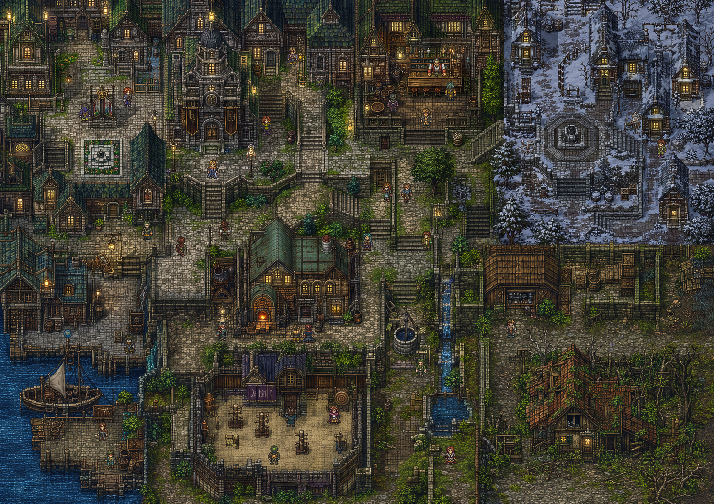
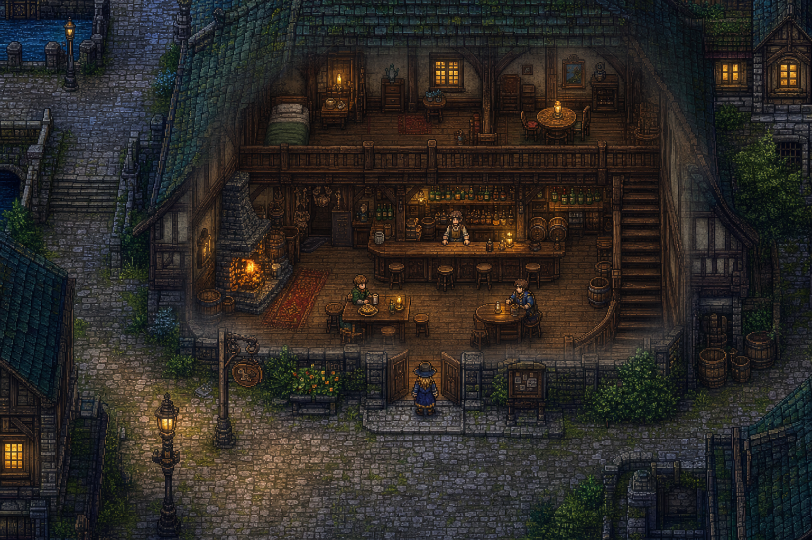
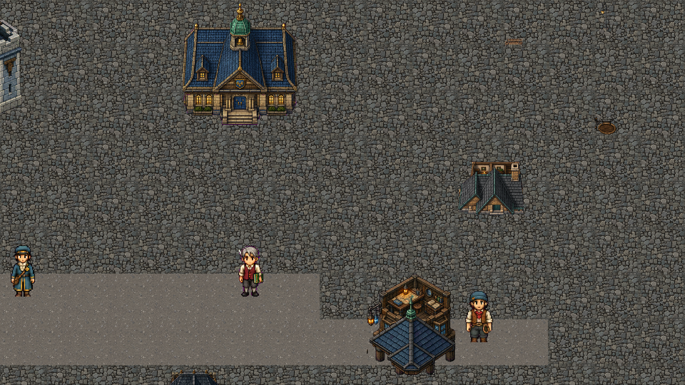
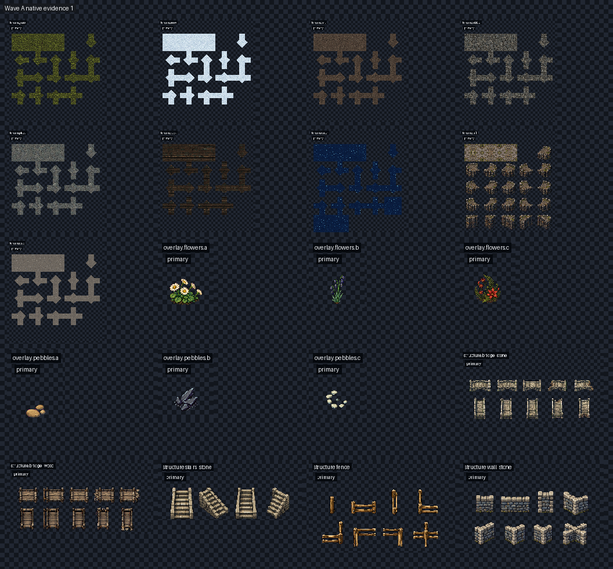

# Fable5 配置デザイン・引き継ぎブリーフ

- 更新日: 2026-07-18
- 対象: Fable5 Wave A / WorldPlan v2
- 状態: **素材候補は生成済み、現在のゲーム画面はデザイン不合格、配置再設計待ち**

## 0. 最初に読んでほしい結論

Wave Aには109 ID / 128 PNGの新規素材候補がある。しかし、現在のscene evidenceは
「素材を裸の地面へ疎に置いた検証画面」であり、ゲーム画面として成立していない。
6枚のscene evidenceを承認候補として扱ってはならない。個別素材の技術適合と、
ゲーム画面の構図・空間・遊びとしての品質は別の問題である。

このブリーフがデザイナーへ依頼するのは、新しいゲーム企画や抽象的なムードボードではない。
現有素材を探索可能な街へ変換する、WorldPlan generatorへ実装可能な
**scene recipe / placement contract**である。

## 1. 品質参照と不合格画面

### 1.1 品質参照の正本

正本: [`world_visual_master.png`](tools/asset-forge/references/approved/world_visual_master.png)
（1491×1055。リポジトリ直下の
[`9e28e43d-56a5-44aa-aa1d-b59461e625dd.png`](9e28e43d-56a5-44aa-aa1d-b59461e625dd.png)
と同一bytes）。これは品質と構図の参照であり、runtime背景として貼り付けてはならない。

カットアウェイの構図参照:

[`cutaway_interior_visual_reference.png`](tools/asset-forge/references/pending/cutaway_interior_visual_reference.png)
は、街路・戸口・家具付き室内・店主・客が同一画面に存在する構図参照である。
この画像はreferenceとして`pending`であり、現行Wave Aのproduction生成入力には明示的に使用禁止である。

### 1.2 現在の不合格画面

現在の6場面:

- [旧市街](tools/asset-forge/review/wave-a/evidence/scene-old-town.png)
- [雪地区](tools/asset-forge/review/wave-a/evidence/scene-snow.png)
- [港地区](tools/asset-forge/review/wave-a/evidence/scene-harbor.png)
- [森林地区](tools/asset-forge/review/wave-a/evidence/scene-woodland.png)
- [夜景](tools/asset-forge/review/wave-a/evidence/scene-night.png)
- [カットアウェイ](tools/asset-forge/review/wave-a/evidence/scene-cutaway.png)

不合格理由は次のとおり。

- 地面の大半が一つの反復面で、街路・敷地・建物群・前景／中景／背景がない。
- 建物、NPC、小物が孤立し、互いに場所の理由や生活の関係を作っていない。
- 雪、港、森林が地形と都市の連続ではなく、水平帯や裸地に見える。
- 入口、目的地、歩行経路、次に見たい場所を画面構図から読めない。
- 森のtree sheetは幹と樹冠を持つが、現rendererは先頭frameだけを描くため幹だけになる。
- カットアウェイは屋根opacityを下げるだけで、既存の床・壁・家具を描いていない。
- 薄暮、暖色灯、接地影、視線誘導、ランドマーク階層が不足する。

## 2. 本来求められた品質

ユーザーが指定した水準は「ピクセルアート素材が置かれている」ことではない。
次の全てを満たすゲーム画面である。

### 2.1 視覚品質

- 密度の高い後期中世ファンタジー都市で、一秒以内に「街」と認識できる。
- 3/4俯瞰。屋根面と正面ファサードが同時に読める平行投影を全素材で統一する。
- 薄暮の青緑／石色を基調とし、窓・提灯・炉の暖色を意味のある焦点にする。
- 石畳、段差、水路、建物、樹木、壁、小物、灯り、人物が一枚の連続した場所を作る。
- 素材ギャラリーではなく、どのスクリーンショットも一枚のイメージボードとして成立する。

### 2.2 空間・ゲーム品質

- プレイヤー位置、入口、歩ける道、目的地候補、ランドマークが画面から読める。
- 道路→前庭／基礎→建物→背景という空間階層を持つ。
- 旧市街、雪、港、森林を色違いの矩形にせず、川、崖、林、海岸、橋、階段で接続する。
- 歩行中に次の場所への予告や手掛かりが見え、移動が空白の通過にならない。
- カットアウェイは別フィールドへ移動せず、街路と家具付き室内を同じ座標系で見せる。

### 2.3 CodeCityとしての意味

- file、directory、import、entrypoint、unresolved、cycle、test association、unreachedを、
  建物、地区、道、門、切れた橋、環状広場、窓灯り、蔦として読める。
- 素材を全て消化することを目的にしない。画面内の全配置はrepo事実か場所の成立に寄与する。
- observed / inferred / unknownを色だけで混同せず、形・状態・住民の言葉で区別する。

### 2.4 可読性と操作品質

- 既定2×表示でplayerを一秒以内に発見できる。
- 建物用途と入口を文字ラベルなしでも推測できる。
- 遮蔽中もplayerと会話対象を見失わない。
- 視覚密度を上げても、歩行可能領域とinteraction対象を判別できる。

### 2.5 既存の数値目標

1280×800、2×表示（視界10×6.25 logical tiles）で:

- 建物2～4棟
- ランドマーク頭部1つ
- NPC 1～3人
- 素の反復地面40%以下
- 意図的な抜け（広場、水面、雪原）を1つ
- 同一tileの縦横3連続禁止
- 地表間の直線継ぎ目禁止

これらは最低値であり、達成しただけで自動的に合格にはならない。

## 3. 実際に作成したWave A候補

### 3.1 状態

- 109 asset IDs
- 128 PNG artifacts（19建物がbase + roofの2 PNG）
- 771 declared sheet slots
- 696 expected-nonempty units
- 12 semantic-transparent cells
- 63 reserved-transparent cells
- 109/109は`pending`
- 人間承認、Wave A selection、v3 approval、v3 exportは全て未実施
- `FORGE_RELEASE_TRUST`のrelease digestは未設定

alpha、cell、seam、nearest resize、source byte replay等の技術検査は通過している。
これは画像ファイルの契約適合であり、アート品質、配置品質、ゲーム品質の承認ではない。

全体gallery:

個別native／repeat evidenceは
[`tools/asset-forge/review/wave-a/evidence/`](tools/asset-forge/review/wave-a/evidence/)
にある。

### 3.2 完全なカテゴリ台帳

| family | 数 | IDs / 内容 |
| --- | ---: | --- |
| terrain | 9 | `grass`, `snow`, `dirt`, `cobble`, `plaza`, `deck`, `water`, `cliff`, `road` |
| ground overlay | 6 | `flowers.a/b/c`, `pebbles.a/b/c` |
| structure | 20 | `bridge_stone`, `bridge_wood`, `stairs_stone`, `fence`, `wall_stone`, `tree.a/b/c`, `rock.a/b/c`, `stone_lantern`, `pier`, `well`, `barricade`, `signpost_broken`, `cycle_wellcurb`, `ferry_shelter`, `searoute_marker`, `survey_plot` |
| building | 19 | `gate`, `town_hall`, `dojo`, `inn`, `warehouse`, `dock`, `guild`, `pub`, `shop`, `workshop`, `watchtower`, `ruin`, `house_s`, `house_m`, `house_old`, `hut`, `rowhouse_s`, `rowhouse_l`, `survey_tower` |
| building overlay | 11 | `ivy.s/m/l`, `scaffold.s/m/l`, `snowcap.s/m/l/xl`, `tarp` |
| interior | 3 | `floor_wood`, `floor_stone`, `wall_trim` |
| prop | 18 | `lamp`, `streetlight`, `signboard`, `notice_board`, `warning_stake`, `barrel`, `crate`, `bench`, `table`, `chair`, `counter`, `shelf`, `desk_ledger`, `bed`, `hearth`, `training_dummy`, `practice_target`, `lantern_warning` |
| character | 7 | `player`, `town_clerk`, `gatekeeper`, `dojo_inspector`, `mob.townsfolk_male`, `mob.townsfolk_female`, `dojo_student` |
| effect | 4 | `water_ripple`, `construction_dust`, `window_glow`, `discovery_glint` |
| UI | 12 | `dialogue_window`, `choice_button`, `speech_bubble`, `journal_book`, `evidence_panel`, `facility_icons`, `evidence_icons`, `key_prompts`, `touch_action`, `cursor`, `footstep`, `town_crest` |

### 3.3 主要フォーマット

- 基準tile: 64×64
- terrain / interior: 320×320、5×5、25 cells
- character: 480×384、48×96 frame、10 actions × 4 directions = 40 frames
- building: 同寸・同pivotの`base` + `roof`
- effect: 4-frame horizontal strip
- props: 主に32～64px幅、48～96px高
- transparent RGBA PNG、hard alpha、nearest-neighbor、非整数拡大禁止
- 光源と投影: 左上奥からの薄暮、3/4俯瞰

## 4. 技術的に追加できる素材

新しい画像APIは不要。Codex内蔵画像生成からAsset Forgeへimportできる。

### 4.1 現パイプラインと同じ契約で追加可能

- 64px terrain autotile family
- 地面・建物状態overlay
- 既存S/M/L/XL/tower/rowhouseクラスのbase + roof建物
- bridge/connect/direction/tree-layer等のstructure sheet
- 透明prop、家具
- 4方向×idle/walk/talk/workのcharacter sheet
- 4-frame effect
- UI sprites

新しいasset IDは、新waveのdefinition、job、候補生成、human approval、export、trust pinが必要。
画像処理基盤の再設計は不要。

### 4.2 設計済みだが未制作のWave B（49 IDs）

- terrain 1: `survey_blank`
- ground overlay 8: `snowdrift.a/b/c`, `leaf_litter.a/b/c`, `moss.a/b`
- structure 1: `stairs_wood`
- props 13: `flowerbed`, `stacked_crates`, `rubble`, `construction_sign`, `stool`, `rug`, `crate_open`, `pot`, `lantern_stand`, `roster_board`, `cargo_scale`, `bottle_rack`, `register_book`
- characters 22: 残りのkeeper 9、mob 9、`townsfolk_c/d`, `elder_f`, `youth`
- effects 4: `chimney_smoke`, `fog_patch`, `snow_fall`, `leaf_fall`

### 4.3 小さなrenderer / WorldPlan変更で使用可能になる既存素材

1. structure / propに`frameIndex`または`variant`を持たせ、bridge、fence、wall、pierの接続形を描く。
2. treeのtrunkとcanopyを同座標へlayer描画する。
3. cutaway中に`room.props`とinterior tilesを描く。
4. 建物ごとのwindow anchorへ`window_glow`を置く。
5. state overlayを建物scale／anchorに対応させる。
6. `water_ripple`と`discovery_glint`を意味のある地点へ配置する。

### 4.4 現契約外

8方向character、任意frame数、APNG、3層以上のbuilding、soft alpha主体の素材、
任意サイズ／任意autotile規則はcontract extensionが必要。

既知の寸法不整合として、asset contract上のtower footprintは2×2だが、現在のWorldPlan側には
3×4相当で扱う箇所がある。tower配置を確定する際は、デザイナーの意図を基に一方へ統一する。

## 5. 現在の実装が素材を活用できていない箇所

- district decorは地区ごとに固定3種程度で、局所構図や建物用途から選ばない。
- prop / structure描画が原則frame 0固定で、connect sheetやtree layerを使わない。
- `lights`は現在空で、窓灯りがない。
- 一般建物へのsnowcapは外しており、安全なroof anchorが未定義。
- cutawayはroof alphaを0.12へ下げるだけで、interior／家具を組み立てない。
- 素材allowlist 109件と、画面内で意味を持って使用される素材集合を混同している。

したがって、不足素材を先に大量生成するのではなく、6つの完成scene recipeを作り、
現有で足りない要素だけを追加backlogへ落とす必要がある。

## 6. デザイナーへ要求する納品物

### 6.1 実寸scene blueprints 6枚

旧市街、雪、港、森林、夜、カットアウェイを各1280×800・2×表示で作る。
現有Wave A素材を実寸使用し、次をannotationとして添える。

- 64px logical tile grid
- asset ID
- anchor / footprint
- frame / layer / z-order
- walkable / collision / occlusion
- landmark、入口、player start、interaction位置

単なる雰囲気画像ではなく、実装座標へ変換できる完成画面にする。

### 6.2 Biome別scene recipe

各biomeについて以下を数値化する。

- terrain面積比
- 道幅、曲がり頻度、交差点間隔
- 建物のstreet frontage、setback、cluster size、最小間隔
- foreground / midground / backgroundの構成
- landmarkの位置と見通し
- 地区境界、水際、崖、橋、階段の使い方
- 意図的な空白の位置と最大面積
- props、foliage、NPC、lightsの画面内個数範囲

### 6.3 全109素材のplacement matrix

各asset IDについて次の列を埋める。

| field | 要求内容 |
| --- | --- |
| allowed biome / scene | 使用可能な場所 |
| gameplay / spatial role | 置く理由 |
| required adjacency | 必須隣接物・接続先 |
| forbidden placement | 禁止位置・禁止組合せ |
| min / max count | 画面内またはcluster内の個数 |
| min spacing | 同一素材との最小距離 |
| anchor / footprint | tile基準座標 |
| frame / layers | sheet cell、trunk/canopy等 |
| z-order / occlusion | 描画順と透過条件 |
| repeat policy | 反復可能性とvariant規則 |
| semantic condition | repo factとの対応条件 |
| slice decision | 使用／不使用／追加素材待ち |

全ID使用は要求しない。不適切な素材は「このsliceでは使わない」と明記する。

### 6.4 建物敷地recipe

各building classおよび主要施設について、建物だけを裸地へ置かないための構成を指定する。

- 接続道路と入口小道
- 基礎縁／踏み固め地面
- 前庭、柵、壁、階段
- 看板、灯り、生活prop
- keeper / resident位置
- 建物正面の安全な歩行余白
- state overlay anchor
- cutaway時の床、家具、通路、NPC

### 6.5 地形・接続・遮蔽規則

- terrain transitionと優先順位
- shoreline、pier、bridge端、cliff、stairsの接続図
- fence / wall / pierのconnect frame選択
- tree trunk / canopyのlayerと潜り時alpha
- 建物、player、NPC、樹冠のz-order
- 直線的なbiome帯、孤立prop、装飾目的だけの行き止まりを禁止する規則

### 6.6 不足素材backlog

現有109でscene blueprintを実現できない場合のみ、次の形式で追加を要求する。

- proposed asset ID
- category / dimensions / grid
- visual description
- required references
- exact scene and placement role
- number of variants
- frame / layer / anchor contract
- priority: blocker / high / optional
- existing assetで代替できない理由

### 6.7 測定可能な合否表

最低限、次をsceneごとに判定する。

- 一秒で街／player／入口を認識できるか
- 裸の反復地面が40%以下か
- 地面の直線継ぎ目がないか
- 画面内にvisual hierarchyがあるか
- 全立体物が接地して見えるか
- 投影、pixel scale、光源が統一されているか
- 目的地候補と歩行経路が読めるか
- biome固有の生活と地理が名前なしで判別できるか
- repo由来の手掛かりが最低1つ見えるか
- screenshotが素材一覧ではなく一つの場所として成立するか

## 7. デザイナーへそのまま渡す依頼文

> あなたはFable5の環境アートディレクター兼レベルデザイナーです。新しいゲーム企画ではなく、既存Wave A 109素材を「探索可能な一つの街」に変換する配置ガイドラインを作成してください。品質参照は`tools/asset-forge/references/approved/world_visual_master.png`、カットアウェイ参照は`tools/asset-forge/references/pending/cutaway_interior_visual_reference.png`です。`tools/asset-forge/review/wave-a/evidence/scene-*.png`は、素材が裸地に孤立した不合格例であり、踏襲禁止です。
>
> 納品物は、(1) 旧市街・雪・港・森林・夜・カットアウェイの実寸6画面、(2) biome別scene recipe、(3) 全109素材のplacement matrix、(4) 建物敷地と室内recipe、(5) 地形接続・layer・遮蔽規則、(6) 不足素材backlog、(7) 測定可能な合否基準です。
>
> 各規則はasset ID、64px tile座標、個数、距離、anchor、frame、layerまで指定し、WorldPlan generatorへ機械実装できる粒度にしてください。「自然に」「適度に」「賑やかに」のような実装不能な表現だけで済ませないでください。素材全消化は目的ではなく、不要素材は未使用と明記して構いません。

## 8. 観測・推測・未確認

### 観測済み

- 品質参照、人物master、カットアウェイ候補、109素材候補、6失敗sceneはrepo内に存在する。
- 109候補は技術検査済みだが全てpendingで、human approval / v3 exportはない。
- 現rendererはtree layer、connect frame、室内家具、窓灯りを十分に使用していない。
- 現sceneは品質参照と既存の数値目標を満たしていない。

### 推測

- Wave Aだけでも現在より大幅に良い最小の密集街は作れる。
- 品質参照の地区差・生活密度まで到達するには、Wave Bまたはデザイナー指定の追加素材が必要になる可能性が高い。

### 未確認

- Wave A個別候補を人間が視覚承認するか。
- デザイナーがWave Aだけで合格sceneを構成できるか。
- export後の実browserにおける最終画面、入力感、fps、初見playtest結果。

## 9. 技術資料

- [Fable5ゲーム設計](Fable5GameDesign.md)
- [Fable5素材計画](Fable5AssetPlan.md)
- [旧引き継ぎ／技術背景](Fable5DesignHandoff.md)
- [Wave A production decisions](tools/asset-forge/data/v2/wave-a-production-decisions.json)
- [Fable5 renderer](public/fable5-v2/app.js)
- [WorldPlan generator](src/town/world-plan-generator.mjs)
- [WorldPlan validator](src/town/world-plan-validator.mjs)
