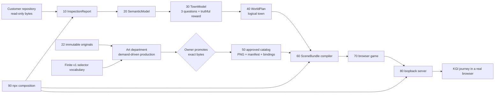

# CodeCity v1 product authority

Status: execution SSOT

This is the only product specification and remaining-work list in the active
repository. `AGENTS.md` is the operating and safety policy. Public `index.mjs`
files and their tests define versioned interfaces. No README, test result,
diagram, issue, chat log, Git history, or generated report may add product
scope or override this file.

Workers must read this file before editing. Workers execute only an unchecked
action assigned by the Lead. If code and this file disagree, the worker stops
and reports the exact disagreement; the Lead either fixes the code or changes
this file explicitly. Workers do not create another roadmap, SSOT, design
projection, backlog, or historical summary.

## 1. Product KGI

CodeCity v1 is complete only when the following journey succeeds from a freshly
packed npm artifact in a real browser:

1. An end user runs `npx codecity <their-repository>`.
2. CodeCity reads the repository without modifying or executing it.
3. A repository-derived pixel-art town opens on `127.0.0.1`.
4. The player accepts one request.
5. The player walks to three distinct investigation sites.
6. Each answer remains explicitly `observed`, `inferred`, or `unknown`.
7. The player reports at a location distinct from the request location.
8. The report causes one evidence-permitted town change that is visible on
   screen.
9. The player exits to the terminal, stops CodeCity, runs the command again,
   and revisits the same town with the completed journey preserved.

Nothing else is the product KGI. A folder, document, contract, passing test,
backend, generated candidate, approval, manifest, SceneBundle, server, first
browser frame, screenshot, or partial demo is enabling work only.

## 2. Non-negotiable truth and safety

- The inspected repository is read-only. CodeCity never runs its source,
  scripts, tests, hooks, binaries, package manager, or build.
- Source and analysis remain local. The server binds literal `127.0.0.1` and
  serves only an immutable allowlisted snapshot.
- `observed`, `inferred`, and `unknown` never collapse into each other.
  File presence may be observed; the behavior suggested by a filename or
  manifest field is inferred; untested behavior is unknown.
- The 22 PNG files in `art/references/user-provided/` are immutable originals.
- A machine may extract, plan, generate, measure, hash, package, and publish
  metadata. Only the human owner may promote exact candidate bytes to an
  approved master.
- There are no placeholder, nearest-match, wildcard, or silent fallback assets
  in the customer path.
- A report never claims that the inspected project builds, runs, passes tests,
  reaches a URL, or talks to an API because CodeCity is forbidden to perform
  those operations.

## 3. v1 scope selected by the Lead

### Included

- Bounded static repository inspection and deterministic town identity.
- Exactly three evidence-grounded investigations for every accepted repository.
- Keyboard movement, collision, readable dialogue, distinct request/report
  locations, three reachable sites, and seamless cutaway interiors where a
  required NPC is indoors.
- The three answer states and their Japanese grammar.
- One truthful v1 reward event:
  `repository_inspected -> town_hall_lantern_lit`. Its observed evidence is the
  successful bounded read-only inspection of the selected repository root. It
  says nothing about whether the repository works.
- Approved pixel art sufficient for every selector that the v1 WorldPlan
  grammar can emit, not merely one fixture repository.
- Local save, explicit exit, process restart, and revisit for the same
  repository identity and content digest.
- A fresh-package browser acceptance run, repository before/after hash check,
  and independent read-only distribution/security review.

### Frozen until after the KGI

- The former 4,654-item asset inventory or any other quantity target.
- Runtime image generation per customer repository.
- More climates, town types, facilities, props, animations, or NPC routines
  than the bounded v1 selector vocabulary requires.
- Scores, achievements, currency, streaks, or gamified engineering grades.
- Audio expansion, English localization, screenshot sharing, settings systems,
  broad gamepad work, cosmetic schedules, and additional verification UIs.
- New schema layers, framework migrations, dashboards, governance documents,
  or tests that do not unblock the KGI journey.

Working safe code for a frozen item may remain. It receives no further effort
before the KGI passes.

## 4. Repository organization and ownership

The first directory below a division is a department or a module boundary.
Subdirectories inside a module are private implementation details, not sibling
modules.

```text
art/
  references/user-provided/       immutable owner input; never shipped

studio/                            PRE-SHIP ONLY; excluded from npm package
  governance/                     this SSOT and actual owner decisions
  art-department/                 originals -> reviewable candidates -> approved handoff
  quality/                        contract, integration, browser and release evidence

ship/                              SHIPPED PRODUCT ONLY
  10-inspect/                     repository -> InspectionReport
  20-semantics/                   InspectionReport -> SemanticModel
  30-town-domain/                 SemanticModel -> TownModel and journey facts
  40-worldgen/                    TownModel -> logical WorldPlan
  50-art/                         approved AssetManifest and exact PNG bytes
  60-scene-compiler/              WorldPlan + approved catalog -> SceneBundle
  70-game-runtime/                SceneBundle -> playable browser game
  80-local-server/                immutable snapshot -> loopback HTTP
  90-cli/                         composition root for npx codecity
```

Shipping dependencies flow from lower numbers to higher numbers. `90-cli` is
the only composition root. A sibling imports only the target module's
`index.mjs`. `40-worldgen` has no image, Canvas, DOM, server, or CLI dependency.
Only `60-scene-compiler` joins world data to art. `70-game-runtime` never reads
a repository. Nothing in `ship/` imports `studio/`.

Tests, fixtures, production tooling, candidate art, reports, approvals, and
release evidence belong in `studio/`, not `ship/`. A directory that contains
only a promise or README is not a module and must not be created.

## 5. End-to-end product data flow



The art department never produces assets to satisfy a count. It compares the
finite selector vocabulary with approved masters and creates work orders only
for uncovered selectors. An empty candidate queue is a valid idle state when
no work order is pending. The machine generates manifest and binding files
from approved masters; the human does not hand-author hashes, dimensions,
pivots, provenance, or JSON.

`scene-bindings.json` is the reusable catalog mapping. The compiler selects
the subset required by the current WorldPlan. Extra valid catalog entries are
not an error; missing required selectors, wildcards, fallbacks, unknown assets,
or byte mismatches are errors.

## 6. Current observed baseline

The following is context for the queue, not completion evidence:

- Modules `10` through `90` exist and their public-boundary test suite passes.
- The current repository produces three investigation sites, but their normal
  reward-transition list is empty.
- The shipping manifest, scene bindings, approved product PNGs, and complete
  art-production line do not exist.
- Diagnostic browser art is test-only and cannot prove visual acceptance or
  the KGI.
- The ordinary browser command therefore remains blocked before server start.

If this baseline changes, update only the checkbox and evidence fields below;
do not append a diary.

## 7. Remaining action items

Each item completes an executable module or the product. Each sentence names
the subject, verb, object, output, and acceptance evidence. Completing an item
does not permit a product-complete claim before `P6`.

### [x] P0 — Lead fixes authority and organizational boundaries

**Subject/action/object:** The Lead replaces the mixed historical MASTER and
duplicate projections with this SSOT, removes obsolete or empty context, and
moves non-shipping tests and tools from `ship/` to `studio/quality/`.

**Output:** one product authority; immutable originals; current production
code under `ship/`; pre-ship work under `studio/`; no active historical
transcripts, quantity backlog, duplicate product diagram, or empty legacy
division.

**Acceptance evidence:** `rg` finds no active reference to the deleted product
documents or 4,654-item target; `npm run check` passes; `npm pack --dry-run`
contains no tests, studio files, originals, candidates, or diagnostic art.

### [ ] P1 — Art department completes a demand-driven production module

**Subject/action/object:** `studio/art-department` consumes the 22 originals
and the finite v1 selector vocabulary, computes approved coverage, and creates
one explicit work order for each uncovered selector.

**Output:** a versioned style authority and palette derived from originals;
machine-readable work orders; deterministic candidate producers; per-candidate
sidecars, lineage, hashes, and quantitative reports; a review queue containing
only submitted candidates.

**Acceptance evidence:** a clean checkout can run one documented command to
reproduce the coverage report and review queue without editing originals or
writing into `ship/`; an empty queue reports `idle`; every submitted candidate
passes or reports exact failed/unknown checks; no API can promote a candidate.

### [ ] H1 — Human owner promotes the complete v1 visual vocabulary

**Subject/action/object:** The human owner accepts or rejects each exact
candidate byte sequence needed by the bounded v1 selector vocabulary.

**Output:** immutable approved masters and hash-bound approval records.

**Acceptance evidence:** every approval binds owner identity, candidate hash,
source hash, decision, and time; rejected or changed bytes cannot be published.
This is the only required human production action.

### [ ] P2 — Art publisher completes the shipping catalog module

**Subject/action/object:** The art publisher consumes only approved masters and
generates `ship/50-art/manifest.json`, `scene-bindings.json`, approved PNGs,
license, and provenance records.

**Output:** one immutable, reusable shipping catalog covering every selector
the v1 WorldPlan grammar can emit.

**Acceptance evidence:** catalog generation is deterministic; all hashes,
dimensions, pivots, usage records, and selector mappings validate; changing or
removing one byte fails; no human hand-edits JSON; no candidate, original,
fixture, wildcard, fallback, or unapproved byte enters `ship/`.

### [ ] P3 — Repository intelligence completes the truthful journey contract

**Subject/action/object:** Modules `10` through `40` convert every accepted
repository into exactly three distinct evidence-grounded investigations and
the single `repository_inspected` observed reward event without executing the
repository.

**Output:** validated InspectionReport, SemanticModel, TownModel, and WorldPlan
objects containing three reachable questions, separate evidence bags, and the
town-hall-lantern transition. The other former execution-result rewards are
removed from the v1 contract.

**Acceptance evidence:** empty, small, and representative inert repositories
each yield exactly three questions and one observed inspection event; trap
scripts/hooks/binaries remain unexecuted; inferred/unknown facts never become
observed; repeated identical bytes produce byte-identical output.

### [ ] P4 — Scene compiler completes catalog-to-town composition

**Subject/action/object:** `60-scene-compiler` selects the exact required subset
from the complete approved catalog and compiles a navigable SceneBundle.

**Output:** terrain, roads, buildings, cutaway rooms, player, NPCs, three quest
sites, distinct request/report interactions, UI bindings, collision/nav data,
and one conditional town-hall-lantern renderable.

**Acceptance evidence:** every required selector resolves to approved bytes;
unused valid catalog mappings are accepted; missing selectors and fallbacks
fail; spawn-to-request, request-to-three-sites, sites-to-report, and interior
NPC routes are collision-free.

### [ ] P5 — Game runtime completes the ordinary RPG loop

**Subject/action/object:** `70-game-runtime` consumes only the serialized
SceneBundle and presents the complete journey with approved art.

**Output:** readable start, movement, collision, cutaway entry, NPC dialogue,
request acceptance, three answers, report, visible lantern change, exit, save,
and revisit. Permanent diagnostic panels and fixture-art paths are absent.

**Acceptance evidence:** a real browser completes the loop by keyboard at the
default viewport and at the narrow supported viewport; the game remains
reachable without fractional pixel scaling; the lantern changes only after
the report; explicit exit persists state; process restart with the same
identity and content digest restores the completed town; one-minute frame
measurement stays within the declared runtime budget.

### [ ] P6 — Delivery and independent QA prove the product KGI

**Subject/action/object:** `90-cli` and `80-local-server` package and serve the
approved product, then an independent read-only reviewer repeats the whole
journey from the packed artifact.

**Output:** an installable npm tarball, actual `npx codecity <repo>` browser
run, KGI evidence, package inventory, license/provenance inventory, and a
separate distribution/security review.

**Acceptance evidence:** the reviewer accepts the request, reaches three sites,
reports, sees the lantern, exits to the terminal, stops the process, reruns the
command, and revisits the preserved town. Repository hashes and mtimes are
unchanged; network capture shows no upload and only loopback service; the
package contains only intended `ship/` bytes; first interaction is available
within 3 seconds on the acceptance machine. Only after this evidence may the
Lead declare CodeCity v1 complete.

## 8. Execution order and parallelism

```text
P1 -> H1 -> P2 --+
                  +-> P4 -> P5 -> P6
P3 ---------------+
```

The Lead may run `P1` and `P3` in parallel. `H1` starts only after P1 produces
reviewable exact bytes. `P4` starts only after P2 and P3 pass. No worker starts
frozen work while a critical-path item remains.

## 9. Forbidden completion language

Workers and the Lead must not say “the game is complete,” “release-ready,” or
equivalent because any of these happened alone:

- tests or boundary checks passed;
- an intermediate module, backend, factory, catalog, asset, or document exists;
- exactly three fixture or inferred investigations exist;
- diagnostic art reaches the browser;
- a candidate or approval exists;
- manifest validation, server startup, screenshot output, or package dry-run
  succeeds;
- a same-process exit/re-entry works.

Reports state only the executable output that was produced and the acceptance
evidence actually observed.
