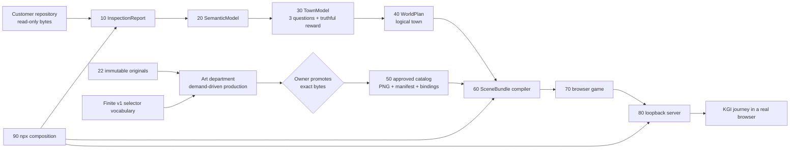

# CodeCity v1 product authority

Status: execution SSOT

This is the only product specification and remaining-work list in the active
repository. `AGENTS.md` is the operating and safety policy. Public `index.mjs`
files and their tests define versioned interfaces. No README, test result,
diagram, issue, chat log, Git history, or generated report may add product
scope or override this file.

Every agent must read this file before acting. If code and this file disagree,
the agent stops and reports the exact disagreement; only the Lead decides
whether to fix the code or change this file. No agent creates another roadmap,
SSOT, design projection, backlog, or historical summary.

## 0. Executive mandate and investment contract

### Parties and identities

- **Investor / human owner:** the human user who commissioned this repository,
  pays for the Codex subscription, supplied the 22 originals and product intent,
  and owns final product and exact-byte asset-promotion decisions. In this file,
  `owner` always means that human user; it never means Codex, a PM, or a worker.
- **End customer:** a person authorized to inspect a local repository who runs
  `npx codecity <their-repository>`. They may be starting a project, actively
  building it, or trying to understand work created with an LLM. They may also
  be the investor, but customer value must still be evaluated separately from
  investor return.
- **Accountable executive / Lead:** the root Codex agent in the active session.
  The Lead allocates the owner's entrusted resources and commands PMs and
  workers. `Lead` is an operational office, not human ownership or legal title.
- **Codex / “I”:** the non-human AI system occupying the Lead office in the
  current session. Codex is not the investor, end customer, human approver, or
  beneficiary. By declaring an allocation, Codex accepts responsibility for
  delegating it, stopping deviations, integrating the result, and reporting the
  promise against evidence.
- **PM and worker agents:** subordinate Codex agents commissioned by the Lead.
  A PM plans and audits; a worker implements only the bounded assignment.

The repository is not a stakeholder. Protecting it from execution, mutation,
or upload is part of the value promised to its authorized end customer. Never
collapse the investor, executive, and customer viewpoints even when the same
human happens to occupy more than one human role.

The human owner has appointed the Lead as the accountable executive, not the
default implementation worker. The Lead owns requirement selection, scope,
priority, capital allocation, decomposition, assignment, integration,
acceptance, owner communication, commits, publication, and every completion
claim. The Lead must use PM agents for decomposition, dependencies, risk, and
acceptance design, and use workers for bounded implementation. The Lead may
inspect and integrate directly, but must not absorb parallelizable production
work or allow agents to self-assign scope.

### Investment supplied by the owner

For this project, investment means finite resources entrusted to the Lead:

- execution capacity already included in the owner's Codex subscription;
- PM and worker agent slots, turns, elapsed time, and attention;
- asset-generation capability available inside that subscription;
- the owner's 22 immutable originals and product decisions;
- the owner's limited attention for batched exact-byte art review cycles.

The plan does **not** assume metered API calls, an API key, a paid external
generator, a SaaS subscription, outsourced production, or any additional
monetary spend. Codex-subscription asset generation and local deterministic
tools are the default production resources. The Lead may not introduce a paid
or metered external dependency without a separate explicit owner decision that
states the requirement served, why subscription resources cannot serve it, and
the stop condition. Local packaging metadata is not authorization to publish
to a network registry.

Subscription capacity has an opportunity cost even when no marginal API bill
is visible. Repeated audits, duplicated tests, speculative abstractions,
unbounded variants, unused assets, parallel workers without independent owned
outputs, and documents that do not remove a KGI blocker are waste. The Lead
must cancel, narrow, or reallocate them.

### Return promised to the owner

Return means verified coverage of the owner's requirements in this file. It
does not mean monetary profit, revenue, or a commercial forecast. Reports state
each KGI requirement as `covered`, `not covered`, or `blocked` and link the
acceptance evidence. Time spent, tokens consumed, agents launched, files,
tests, candidates, approvals, and modules are investment or production
evidence; none is return by itself.

The realized return is a 9-of-9 KGI journey from one freshly packed artifact.
Partial requirement coverage may guide capital allocation, but CodeCity is not
complete until all nine requirements succeed together in the P6 run.

### Operating roles

| Role | Accountable output | Forbidden authority |
|---|---|---|
| Human owner | Product decisions and batched promotion decisions over exact candidate bytes | Manual production, metadata authoring, routine QA, project management |
| Lead / executive | Scope, investment allocation, assignments, integration, acceptance and truthful reporting | Inventing owner intent, hiding cost, treating activity as return |
| PM agent | Read-only decomposition, dependency graph, risk/acceptance audit and worker coordination advice | Product scope changes, implementation unless separately assigned as a worker, acceptance or completion claims |
| Worker agent | One bounded implementation output inside explicit owned paths, with evidence and stop condition | Self-assignment, neighboring-path edits, commits, pushes, publication, approval, roadmap changes |
| Independent reviewer | Read-only P6 journey, package, privacy, distribution and security evidence | Implementing or repairing the work being reviewed |

Every worker assignment states: the KGI requirement advanced, owned paths,
forbidden paths, bounded output, acceptance evidence, dependencies, and stop
condition. A worker stops rather than improvises when it needs owner approval,
external spend, a frozen feature, an undefined selector, a scope change, or a
write outside its owned paths.

### G0 — Binding three-view pre-start declaration

Execution defaults to `STOP` for every fresh Lead. Before `GO`, the Lead and
read-only PM agents may inspect the repository, identify dependencies, estimate
subscription resource use, and draft the declaration below. They may not mutate
the workspace or external state, start implementation workers, generate
candidate assets, commit, push, publish, approve, or promote anything.

The Lead issues one user-visible declaration in this exact form:

```text
G0 EXECUTION DECLARATION
Status: GO | STOP

IDENTITIES
Investor / owner:
Accountable executive / Lead:
Codex / I:
End customer:

INVESTOR / OWNER
Return promised:
Owner requirements covered by this execution:
Authorized subscription investment:
Owner attention or asset decisions required:
Excluded spend and authority:

ACCOUNTABLE EXECUTIVE / LEAD
Why this allocation is the smallest viable path to customer value:
Critical-path allocation and order:
PM and worker assignments:
Independent work allowed in parallel:
Resource envelope before the next checkpoint:
Dependencies and unresolved decisions:
Scope explicitly frozen:

END CUSTOMER AND THEIR REPOSITORY
Supported repository class:
Acceptance repositories or selection rule:
Literal acquisition and launch command:
Browser environment and supported viewports:
Customer behavior changed by this execution:
Repository harm or failure prevented:

EVIDENCE VALUE
Observed evidence required:
What that evidence proves for the owner:
What that evidence proves for the customer:
What it explicitly does not prove:
Inferred assumptions:
Unknowns that remain visible:
Independent reviewer:

TEST OBLIGATIONS
For each planned test or test group:
- concrete customer failure prevented:
- owner requirement evidenced:
- repository harm prevented:
- observable pass/fail result:
- what passing does not prove:

STOP CONDITIONS
Conditions that immediately return execution to STOP:
Next Lead/owner checkpoint:
```

`GO` is valid only when all identities and all three viewpoints are concrete,
every unresolved owner choice that could change the next allocation is resolved,
the subscription resource envelope is finite, and every planned test names a
concrete customer failure plus the owner requirement it evidences. A module
name, implementation detail, coverage percentage, test count, or “more safety”
without a named harm is not a valid investment reason.

The Lead's declaration is binding. A changed customer, repository class,
selector vocabulary, customer journey, safety assumption, resource envelope,
owner dependency, test purpose, or critical path invalidates `GO`. The Lead
returns to `STOP`, performs only read-only replanning, and issues a replacement
declaration before work resumes.

At handoff, the Lead reproduces the governing declaration and marks every
promised line `met`, `not met`, or `blocked`, with observed evidence and actual
resource use. An undeclared deviation is an executive failure, not implicit
approval. No completion claim is permitted unless P6 independently verifies
the customer obligations under the same declaration.

## 1. Product KGI

CodeCity v1 is complete only when the following journey succeeds from a freshly
packed npm artifact in a real browser:

1. An end user runs `npx codecity <their-repository>`.
2. CodeCity reads the repository without modifying or executing it.
3. A repository-derived pixel-art town opens on `127.0.0.1`.
4. The player accepts one request.
5. The player walks to three distinct investigation sites.
6. Each answer remains explicitly `observed`, `inferred`, or `unknown`.
7. The player reports at a location distinct from the request location.
8. The report causes one evidence-permitted town change that is visible on
   screen.
9. The player exits to the terminal, stops CodeCity, runs the command again,
   and revisits the same town with the completed journey preserved.

Nothing else is the product KGI. A folder, document, contract, passing test,
backend, generated candidate, approval, manifest, SceneBundle, server, first
browser frame, screenshot, or partial demo is enabling work only.

### Customer value delivered by the KGI

The end customer turns a local repository into a private, persistent town with
one command. They walk through three repository-derived questions instead of
reading a technical audit, can distinguish what CodeCity observed from what it
inferred or could not know, see their completed report change the town, and can
return to the same place later. CodeCity offers comprehension, truthful
uncertainty, and ownership without uploading or executing the customer's code;
it does not pretend to certify that the repository builds or works.

## 2. Non-negotiable truth and safety

- The inspected repository is read-only. CodeCity never runs its source,
  scripts, tests, hooks, binaries, package manager, or build.
- Source and analysis remain local. The server binds literal `127.0.0.1` and
  serves only an immutable allowlisted snapshot.
- `observed`, `inferred`, and `unknown` never collapse into each other.
  File presence may be observed; the behavior suggested by a filename or
  manifest field is inferred; untested behavior is unknown.
- The 22 PNG files in `art/references/user-provided/` are immutable originals.
- A machine may extract, plan, generate, measure, hash, package, and publish
  metadata. Only the human owner may promote exact candidate bytes to an
  approved master.
- There are no placeholder, nearest-match, wildcard, or silent fallback assets
  in the customer path.
- A report never claims that the inspected project builds, runs, passes tests,
  reaches a URL, or talks to an API because CodeCity is forbidden to perform
  those operations.

## 3. v1 scope selected by the Lead

### Included

- Bounded static repository inspection and deterministic town identity.
- Exactly three evidence-grounded investigations for every accepted repository.
- Keyboard movement, collision, readable dialogue, distinct request/report
  locations, three reachable sites, and seamless cutaway interiors where a
  required NPC is indoors.
- The three answer states and their Japanese grammar.
- One truthful v1 reward event:
  `repository_inspected -> town_hall_lantern_lit`. Its observed evidence is the
  successful bounded read-only inspection of the selected repository root. It
  says nothing about whether the repository works.
- Approved pixel art sufficient for every selector that the v1 WorldPlan
  grammar can emit, not merely one fixture repository.
- Local save, explicit exit, process restart, and revisit for the same
  repository identity and content digest.
- A fresh-package browser acceptance run, repository before/after hash check,
  and independent read-only distribution/security review.

### Frozen until after the KGI

- The former 4,654-item asset inventory or any other quantity target.
- Runtime image generation per customer repository.
- More climates, town types, facilities, props, animations, or NPC routines
  than the bounded v1 selector vocabulary requires.
- Scores, achievements, currency, streaks, or gamified engineering grades.
- Audio expansion, English localization, screenshot sharing, settings systems,
  broad gamepad work, cosmetic schedules, and additional verification UIs.
- New schema layers, framework migrations, dashboards, governance documents,
  or tests that do not unblock the KGI journey.

Working safe code for a frozen item may remain. It receives no further effort
before the KGI passes.

## 4. Repository organization and ownership

The first directory below a division is a department or a module boundary.
Subdirectories inside a module are private implementation details, not sibling
modules.

```text
art/
  references/user-provided/       immutable owner input; never shipped

studio/                            PRE-SHIP ONLY; excluded from npm package
  governance/                     this SSOT and actual owner decisions
  art-department/                 originals -> reviewable candidates -> approved handoff
  quality/                        contract, integration, browser and release evidence

ship/                              SHIPPED PRODUCT ONLY
  10-inspect/                     repository -> InspectionReport
  20-semantics/                   InspectionReport -> SemanticModel
  30-town-domain/                 SemanticModel -> TownModel and journey facts
  40-worldgen/                    TownModel -> logical WorldPlan
  50-art/                         approved AssetManifest and exact PNG bytes
  60-scene-compiler/              WorldPlan + approved catalog -> SceneBundle
  70-game-runtime/                SceneBundle -> playable browser game
  80-local-server/                immutable snapshot -> loopback HTTP
  90-cli/                         composition root for npx codecity
```

Shipping dependencies flow from lower numbers to higher numbers. `90-cli` is
the only composition root. A sibling imports only the target module's
`index.mjs`. `40-worldgen` has no image, Canvas, DOM, server, or CLI dependency.
Only `60-scene-compiler` joins world data to art. `70-game-runtime` never reads
a repository. Nothing in `ship/` imports `studio/`.

Tests, fixtures, production tooling, candidate art, reports, approvals, and
release evidence belong in `studio/`, not `ship/`. A directory that contains
only a promise or README is not a module and must not be created.

## 5. End-to-end product data flow



The art department never produces assets to satisfy a count. It compares the
finite selector vocabulary with approved masters and creates work orders only
for uncovered selectors. An empty candidate queue is a valid idle state when
no work order is pending. The machine generates manifest and binding files
from approved masters; the human does not hand-author hashes, dimensions,
pivots, provenance, or JSON.

`scene-bindings.json` is the reusable catalog mapping. The compiler selects
the subset required by the current WorldPlan. Extra valid catalog entries are
not an error; missing required selectors, wildcards, fallbacks, unknown assets,
or byte mismatches are errors.

## 6. Current observed baseline

The following is context for the queue, not completion evidence:

- Modules `10` through `90` exist and their public-boundary test suite passes.
- The current repository produces three investigation sites, but their normal
  reward-transition list is empty.
- The shipping manifest, scene bindings, approved product PNGs, and complete
  art-production line do not exist.
- Diagnostic browser art is test-only and cannot prove visual acceptance or
  the KGI.
- The ordinary browser command therefore remains blocked before server start.

If this baseline changes, update only the checkbox and evidence fields below;
do not append a diary.

## 7. Remaining action items

No action item may receive an implementation worker, mutation, asset generation,
or external-state action unless the current Lead has issued a valid `G0: GO`
declaration. Read-only Lead/PM planning before `GO` does not change item status
and is not reported as return.

Each item is an investment allocation, not a milestone claim. Before assigning
work from an item, the Lead creates a bounded assignment that names the KGI
requirement covered, owned and forbidden paths, output, acceptance evidence,
dependencies, owner dependency, and stop condition. The Lead records coverage
only as `covered`, `not covered`, or `blocked`; effort spent and artifacts
produced are not return. Only `P6` verifies the accumulated return through the
product KGI.

### [x] P0 — Lead fixes authority and organizational boundaries

**Subject/action/object:** The Lead replaces the mixed historical MASTER and
duplicate projections with this SSOT, removes obsolete or empty context, and
moves non-shipping tests and tools from `ship/` to `studio/quality/`.

**Output:** one product authority; immutable originals; current production
code under `ship/`; pre-ship work under `studio/`; no active historical
transcripts, quantity backlog, duplicate product diagram, or empty legacy
division.

**Acceptance evidence:** outside this SSOT's explicit frozen-scope warning,
`rg` finds no active reference to the deleted product documents or former
4,654-item target; `npm run check` passes; `npm pack --dry-run` contains no
tests, studio files, originals, candidates, or diagnostic art. P0 remains
closed unless an actual organizational regression is observed.

**Three-view value:** the owner no longer funds contradictory context; the
Lead has one authority for allocation; the customer package excludes internal
tests, originals, candidates, and diagnostic art. These checks prove repository
organization and package exclusion only; they do not prove a playable town.

**Stop condition:** keep P0 closed unless an observed organizational regression
reintroduces conflicting authority or non-product bytes into the package.

### [x] P1 — Lead obtains the minimum reviewable v1 art candidates

**KGI coverage:** approved art for every selector reachable in the bounded v1
journey.

**Subject/action/object:** The Lead first assigns a PM to derive the finite
reachable selector gap and freezes that list. The Lead then assigns independent
candidate work orders to Codex workers. Workers may extract or transform the
immutable originals or generate candidate art using capabilities included with
the Codex subscription. They do not promote assets or write into `ship/`.

**Output:** a style authority and palette derived from the originals; one exact
reviewable candidate, sidecar, provenance record, hash, and gate report for
every uncovered required selector. Candidate bytes need not be reproducible;
their review identity is their exact hash. The approval-to-package publisher,
not image generation, must be deterministic.

**Acceptance evidence:** the Lead-approved finite selector list is present and
every item has an exact submitted candidate; each candidate has visible review
material and reports every mechanical check as passed, failed, or unknown;
originals are unchanged; no machine promotion command, paid API, external
service, API key, or separately built image-generation platform is required.
P1 evidence is `studio/art-department/v1/candidates/index.json`, independently
audited against `studio/quality/gates/v1-candidate-batch.mjs`: the submitted set
equals the 60 sorted, unique frozen selectors; every candidate, sidecar or
provenance record, review record, source trace, exact hash, byte length, and
dimension resolves; both hash-bound contact sheets and ordered review manifests
exist; and all 22 immutable originals retain their frozen hashes. Exact-byte
reuse is explicit and hash-equal with one canonical selector per byte group. All
14 `room:*` selectors use one source-traced cutaway interior candidate that is
byte-distinct from every exterior; facility-specific visual differentiation is
`unknown` for H1 rather than inferred. Release-focused H1 review replaced ten
known blockers: the player now has the required 192x256, 6x8, 32px animation
sheet; foreground markers are isolated at no more than 64px; the gate is one
building; and four UI candidates are text-free, data-free frames within the
384x216 viewport. The final owner-quality correction also makes lit/unlit
lantern states share one alpha mask with a visible color-state difference,
replaces the path-like meadow with a ground-only seamless grass tile, and
separates shoreless open water from the coast candidate. A hash-bound evidence
manifest provides 3x3 seam and
plot/building composition previews for the seven previously undecidable
tile/plot selectors plus final semantic previews for meadow and water. The full
world pixel gate truthfully reports 15 candidate passes and 24 candidate
failures, with G2, G6, G8, and G10 failures preserved per
selector; every check is recorded as passed, failed, or unknown, and no pending
state remains. One Codex-included generation call was used for `building:dock`;
the blocker-correction loop used deterministic extraction and zero additional
generation calls. No paid API, external service, API key, machine
promotion, original mutation, or `ship/` write was used. This closes candidate
production only: owner approval remains unknown, and the evidence does not prove
H1, P2-P6, scene composition, browser playability, or the product KGI. The
unchanged scene compiler still rejects the new reward transition with
`REWARD_TRANSITION_INVALID`, which remains a P4 blocker.

**Owner dependency:** the Lead batches the complete exact candidate set for H1
and minimizes review cycles. A rejection reopens only that selector's work
order; it never creates pressure to accept deficient bytes or reopen the full
inventory.

**Stop condition:** stop candidate production when the frozen selector gap is
empty. Do not create variants, inventory, production frameworks, or assets for
frozen scope.

**Three-view value:** the owner funds only art required by the frozen customer
journey; the Lead can stop at a finite selector gap; the customer receives
reviewable visual coverage without their repository being written, executed,
or uploaded. Candidate hashes and gate reports prove custody and measured
properties only; they do not prove human approval, shipping, or playability.

### [ ] H1 — Human owner promotes the complete v1 visual vocabulary

**Subject/action/object:** The human owner accepts or rejects each exact
candidate byte sequence needed by the bounded v1 selector vocabulary.

**Output:** immutable approved masters and hash-bound approval records.

**Acceptance evidence:** every approval binds owner identity, candidate hash,
source hash, decision, and time; rejected or changed bytes cannot be published.
Asset promotion is the only required human art-production action. The Lead
batches the complete bounded review set to minimize owner attention. Rejected
required selectors return to P1; only accepted selectors proceed to P2.

**Three-view value:** the owner controls the exact bytes representing the
product; the Lead cannot counterfeit that authority; the customer is protected
from unapproved or silently changed visuals. Approval proves byte authorization
only, not readability, navigation, browser behavior, or the KGI.

**Stop condition:** wait for the human decision; never infer acceptance. A
rejection reopens only its selector work order.

### [ ] P2 — Art publisher completes the shipping catalog module

**Subject/action/object:** The art publisher consumes only approved masters and
generates `ship/50-art/manifest.json`, `scene-bindings.json`, approved PNGs,
license, and provenance records.

**Output:** one immutable, reusable shipping catalog covering every selector
the v1 WorldPlan grammar can emit.

**Acceptance evidence:** catalog generation is deterministic; all hashes,
dimensions, pivots, usage records, and selector mappings validate; changing or
removing one byte fails; no human hand-edits JSON; no candidate, original,
fixture, wildcard, fallback, or unapproved byte enters `ship/`.

**Three-view value:** the owner's approved visual investment becomes a bounded
shipping input; the Lead receives a deterministic integration boundary; the
customer cannot receive mismatched, placeholder, fallback, or unapproved bytes.
Catalog validation proves integrity and mapping only, not aesthetics, routes,
browser play, or the KGI.

**Stop condition:** stop when every frozen v1 selector resolves to an approved
byte and the generated catalog validates; block on any missing or changed byte.

### [x] P3 — Repository intelligence completes the truthful journey contract

**Subject/action/object:** Modules `10` through `40` convert every accepted
repository into exactly three distinct evidence-grounded investigations and
the single `repository_inspected` observed reward event without executing the
repository.

**Output:** validated InspectionReport, SemanticModel, TownModel, and WorldPlan
objects containing three reachable questions, separate evidence bags, and the
town-hall-lantern transition. The other former execution-result rewards are
removed from the v1 contract.

**Acceptance evidence:** the frozen empty, small, and representative inert
regular-directory cohort each produces exactly three distinct candidate IDs,
facility kinds, and WorldPlan plots plus the single canonical
`repository_inspected` binding and observed transition. The representative
fixture includes lifecycle/build/test traps, a Git hook, executable shell and
ELF-like bytes, excluded dependency/build directories, credential-bearing Git
configuration, and an out-of-root symlink sentinel; before/after byte hashes,
modes, mtimes, and outside snapshots remain identical and no marker appears.
Root symlinks are rejected and internal symlinks are not followed. Repeated
inspection and WorldPlan serialization are byte-identical; malformed evidence,
arbitrary NPC roles, and zero or duplicate inspection transitions are rejected
at the public boundaries. This targeted evidence covers backend truth and
determinism only for that synthetic cohort; it does not prove approved art,
scene compilation, browser behavior, package acquisition, privacy capture,
persistence, distribution/security, or the KGI journey.

**Three-view value:** the owner receives the core repository-to-game meaning
instead of more infrastructure; the Lead obtains a truthful serialized contract;
the customer receives three understandable repository-derived investigations
without their repository being executed, modified, uploaded, or falsely
certified. These tests prove backend truth and determinism for the frozen
repository cohort only, not browser delivery or customer experience.

**Stop condition:** stop when the frozen accepted-repository cohort produces
three questions and the one permitted observed event with evidence states
preserved; stop immediately if implementation would execute customer code or
add another reward.

### [ ] P4 — Scene compiler completes catalog-to-town composition

**Subject/action/object:** `60-scene-compiler` selects the exact required subset
from the complete approved catalog and compiles a navigable SceneBundle.

**Output:** terrain, roads, buildings, cutaway rooms, player, NPCs, three quest
sites, distinct request/report interactions, UI bindings, collision/nav data,
and one conditional town-hall-lantern renderable.

**Acceptance evidence:** every required selector resolves to approved bytes;
unused valid catalog mappings are accepted; missing selectors and fallbacks
fail; spawn-to-request, request-to-three-sites, sites-to-report, and interior
NPC routes are collision-free.

**Three-view value:** the owner's backend and art investments become one bounded
scene; the Lead retires the composition dependency; the customer receives a
navigable logical route through request, three sites, report, NPCs, and the
permitted change without exposing their repository to the runtime. Compiler
tests prove bindings, collisions, and logical reachability only, not browser
feel, persistence, acquisition, or the KGI.

**Stop condition:** do not start before P2 and P3 are covered; stop once the
bounded SceneBundle and required routes validate, without adding world variants.

### [ ] P5 — Game runtime completes the ordinary RPG loop

**Subject/action/object:** `70-game-runtime` consumes only the serialized
SceneBundle and presents the complete journey with approved art.

**Output:** readable start, movement, collision, cutaway entry, NPC dialogue,
request acceptance, three answers, report, visible lantern change, exit, save,
and revisit. Permanent diagnostic panels and fixture-art paths are absent.

**Acceptance evidence:** a real browser completes the loop by keyboard at the
default viewport and at the narrow supported viewport; the game remains
reachable without fractional pixel scaling; the lantern changes only after
the report; explicit exit persists state; process restart with the same
identity and content digest restores the completed town; one-minute frame
measurement stays within the declared runtime budget.

**Three-view value:** the owner first receives an executable customer-value
slice rather than another internal artifact; the Lead proves that composition
works as a game; the customer can actually move, understand, report, see change,
exit, and revisit while their repository remains outside the runtime. Browser
acceptance proves the frozen runtime environment only, not package acquisition,
independent review, or final KGI return.

**Stop condition:** stop when the declared browser journey and performance
envelope pass; do not expand into frozen audio, localization, settings, gamepad,
or cosmetic work.

### [ ] P6 — Delivery and independent QA prove the product KGI

**Subject/action/object:** `90-cli` and `80-local-server` package and serve the
approved product, then an independent read-only reviewer repeats the whole
journey from the packed artifact.

**Output:** an installable npm tarball, actual `npx codecity <repo>` browser
run, KGI evidence, package inventory, license/provenance inventory, and a
separate distribution/security review.

**Acceptance evidence:** the reviewer accepts the request, reaches three sites,
reports, sees the lantern, exits to the terminal, stops the process, reruns the
command, and revisits the preserved town. Repository hashes and mtimes are
unchanged; network capture shows no upload and only loopback service; the
package contains only intended `ship/` bytes; first interaction is available
within 3 seconds on the acceptance machine. Only after this evidence may the
Lead declare CodeCity v1 complete.

**Three-view value:** the owner receives the promised requirement coverage from
the authorized subscription investment; the Lead's declaration is independently
audited; the end customer obtains and plays the literal product while their
repository remains unchanged, unexecuted, local, and truthfully represented.
This is the only action whose evidence can realize the full investment return.

**Stop condition:** any missing KGI step, acquisition failure, repository
mutation/execution, upload, non-loopback service, package contamination, or
reviewer conflict returns status to `STOP` and forbids completion or publication.

## 8. Execution order and parallelism

```text
G0 GO -> P1 -> H1 accepted -> P2 --+
          ^      |                  +-> P4 -> P5 -> P6
          +------+ rejected         |
       -> P3 -----------------------+
```

`G0` is a continuing execution condition, not a milestone. Any declared stop
condition suspends P1–P6 until the Lead issues a valid replacement declaration.

The Lead allocates `P1` and `P3` in parallel only while their worker assignments
are independent and bounded. PM agents own decomposition, dependency tracking,
acceptance criteria, and read-only risk review; workers own only assigned paths
and outputs. The Lead retains scope, integration, owner communication, and
acceptance decisions.

`H1` starts only when P1 has batched the complete exact-byte review set. A
rejection reopens only its bounded selector work order. `P4` starts only after
P2 and P3 are covered. The Lead stops or reallocates any work on frozen scope,
duplicate evidence, or intermediate polish while a critical KGI dependency
remains uncovered.

## 9. Forbidden completion language

Workers and the Lead must not say “the game is complete,” “release-ready,” or
equivalent because any of these happened alone:

- tests or boundary checks passed;
- a test count, coverage percentage, or green suite is reported without the
  owner requirement and concrete customer failure it evidences;
- an intermediate module, backend, factory, catalog, asset, or document exists;
- exactly three fixture or inferred investigations exist;
- diagnostic art reaches the browser;
- a candidate or approval exists;
- manifest validation, server startup, screenshot output, or package dry-run
  succeeds;
- a same-process exit/re-entry works.

Reports state only the executable output that was produced and the acceptance
evidence actually observed.
