# CodeCity product structure

This is a structural projection of `MASTER.md`, not a second design authority.
If wording differs, `MASTER.md` wins. A box in this diagram states a required
product boundary; it does not claim that the box is implemented or accepted.

```mermaid
flowchart TB
  KGI["Product KGI<br/>A customer points npx codecity at their repository,<br/>plays its generated pixel-art town through request → three investigations → report → observed change,<br/>then exits and revisits in a real browser"]

  subgraph INPUTS["Customer-owned inputs — remain local and read-only"]
    PEOPLE["Three customer states<br/>A: wants to make / nearly empty<br/>B: actively building / already runs<br/>C: had an LLM build it / does not know the internals"]
    REPO["Customer repository<br/>source · manifests · static relationships · git metadata"]
    ANNO["Optional human semantic annotations<br/>inferred / unknown only"]
  end

  subgraph BACKEND["Shipping backend — pure serialized contracts between modules"]
    I10["ship/10-inspect<br/>bounded read-only inspection<br/>never executes repository code, hooks, tests, binaries, or package manager"]
    IR["InspectionReport v1<br/>repository identity · files · manifests · import graph · entrypoints<br/>observed / inferred / unknown"]
    I20["ship/20-semantics<br/>semantic normalization"]
    SM["SemanticModel v1<br/>7 file roles · connections · 9 capabilities<br/>evidence preserved per fact"]
    I30["ship/30-town-domain<br/>repository meaning → RPG town meaning"]
    TM["TownModel v1<br/>14 canonical facilities · facts · habitability Lv.0–5<br/>guild roster · investigations · reward transitions"]
    I40["ship/40-worldgen<br/>deterministic logical world generation"]
    WP["WorldPlan v1<br/>L1 identity: climate · terrain · water · roads · topology · all plots<br/>L2 life: occupancy · rooms · NPCs · props · lights · quest sites<br/>navigation · sightlines · validation"]

    REPO --> I10 --> IR --> I20 --> SM --> I30 --> TM --> I40 --> WP
    ANNO --> I20
  end

  subgraph DOMAIN["Town-domain invariants"]
    PERSONALITY["Repository personality before facility expectations<br/>post town / workshop town / port town / watch post / research village<br/>irrelevant facilities are not shown as failures or named empty lots"]
    FAC["14 canonical facility meanings<br/>gate · inn · pub · guild · town hall · dock · warehouse<br/>well · workshop · dojo · watchtower · house · shop/repair · ruin"]
    GUILD["Guild roster<br/>なかま · うけつけ · いらい · もちもの · じょうたい<br/>only top 3 connection representatives stand in the tavern"]
    QUEST["Investigation loop<br/>release journey: request → exactly 3 real sites → choose observed / inferred / unknown → report<br/>contracts never pad or invent absent candidates"]
    REWARD["Only observed screen changes are rewards<br/>exact 9 permitted bindings; no score, achievement, currency, or self-report reward"]
    LEVEL["Habitability Lv.0–5<br/>dirt is a visible state; missing/untested stays unknown"]
    LEDGER["Town-hall construction ledger<br/>Co-Authored-By history → contractor self-report on the left<br/>official test result on the right; untested remains a gray seal"]

    I30 --- PERSONALITY
    I30 --- FAC
    I30 --- GUILD
    I30 --- QUEST
    I30 --- REWARD
    I30 --- LEVEL
    I30 --- LEDGER
  end

  subgraph WORLD["World-generation invariants"]
    TOPO["Fixed topology<br/>front gate → main street → central plaza<br/>plaza → civic / market / guild<br/>guild → rear high ground"]
    GEO["Variable geometry from stable repository identity<br/>5 town types · 5 climates · 12–20 plots<br/>all plots allocated before repository occupancy"]
    LAYERS["L1 never moves when repository facts change<br/>L2 may move in/out while geography, plot IDs, roads, water, and skyline stay stable"]
    NAV["Mechanical town-hall inspection<br/>gate-to-plaza route · facility access · walkable navigation<br/>plot bounds · overlap · sightline · generation-time budget"]

    I40 --- TOPO
    I40 --- GEO
    I40 --- LAYERS
    I40 --- NAV
  end

  subgraph FACTORY["studio/art-department + studio/quality/gates — independent production organization"]
    ORIGINALS["22 immutable user originals<br/>art/references/user-provided<br/>full SHA-256 custody gate"]
    AUTH["Style authority extracted from originals<br/>projection · 2.9 heads · shared light · palette · grounding · UI forms"]
    CAND["4,654-item production inventory → candidates<br/>extract / normalize / draw missing motion / attach lineage"]
    GATES["studio/quality/gates<br/>dimensions · frames · palette · alpha · grounding · silhouette · hash · provenance · license"]
    HUMAN{"Human owner approval"}
    MASTERASSET["Approved masters<br/>versioned · immutable · reversible"]

    ORIGINALS --> AUTH --> CAND --> GATES --> HUMAN
    HUMAN -->|accepted| MASTERASSET
    HUMAN -->|rejected| CAND
  end

  subgraph ARTCONTRACT["Shipping art boundary"]
    I50["ship/50-art<br/>strict accepted-manifest validation + approved bytes<br/>no placeholder and no fallback"]
    AM["AssetManifest v1<br/>local path · full byte hash · dimensions · pivot<br/>license · source provenance · human approval"]
    SHIPART["ship/50-art/&lt;classification&gt;<br/>only approved bytes"]

    MASTERASSET --> AM
    MASTERASSET --> SHIPART
    AM --> I50
    SHIPART --> I50
  end

  subgraph COMPILE["One authorized join point"]
    I60["ship/60-scene-compiler<br/>WorldPlan + exact approved asset bindings → SceneBundle"]
    SB["SceneBundle v1<br/>repository identity + content digest<br/>logical cells + render layers + collisions + interactions<br/>rooms + NPCs + quest sites + UI bindings + evidence addresses"]

    WP --> I60
    I50 --> I60
    I60 --> SB
  end

  subgraph RUNTIME["Customer-facing game — no repository inspection"]
    I70["ship/70-game-runtime<br/>consumes serialized SceneBundle only"]
    RENDER["Pixel-art renderer<br/>integer scale · nearest-neighbor · 3-face oblique town<br/>camera · time-of-day and climate palette layers"]
    MOVE["Play<br/>default run / Shift walk · keyboard + gamepad<br/>collision · prompts · seamless exterior/interior transition"]
    NPC["Town life<br/>NPC schedules · dialogue voice grammar<br/>observed='です' / inferred='ようです' / unknown='まだ、わかりません'"]
    UI["In-world information addresses<br/>dark repository-name board · dialogue · choices<br/>guild roster · town-hall inspection report · overlook"]
    LOOP["Core loop<br/>gatekeeper → innkeeper vocabulary → request → 3 investigations<br/>report → one observed town change → quiet acknowledgement"]
    STATE["Local state and revisit<br/>repository-identity key · no source upload<br/>growth and loss shown without blame"]
    EXIT["Exit and sharing<br/>Esc paths · terminal return line · privacy-safe image export<br/>revisit preserves L1 town identity"]
    ACCESS["Accessibility and comfort<br/>reduced motion · readable contrast · remapping<br/>mute/volume · no flashing · responsive viewport"]
    SOUND["Sound and motion contracts<br/>place-based ambience · restrained effects · no autoplay surprise<br/>shared easing · readable 4-frame walk and 6-frame run"]
    L10N["Japanese default + English<br/>12×12/6×12 text · 2/3 dialogue lines<br/>concept-preserving town vocabulary and line breaking"]
    JOURNEY["Whole experience P0–P8<br/>encounter → launch → town rises → first minute → walk → report<br/>leave → revisit → habit and pride"]

    SB --> I70
    I70 --> RENDER
    I70 --> MOVE
    I70 --> NPC
    I70 --> UI
    I70 --> LOOP
    I70 --> STATE
    I70 --> EXIT
    I70 --> ACCESS
    I70 --> SOUND
    I70 --> L10N
    I70 --> JOURNEY
  end

  subgraph DELIVERY["Local in-memory delivery and composition"]
    I80["ship/80-local-server<br/>127.0.0.1 only<br/>immutable hash-bound memory snapshot; no uploads or distribution directory"]
    I90["ship/90-cli — composition root<br/>npx codecity repository-path"]
    START["Startup experience<br/>validate path → inspect → map → generate → compile<br/>start loopback server → open browser; failures remain evidence-accurate"]

    I90 --> I10
    I90 --> I20
    I90 --> I30
    I90 --> I40
    I90 --> I50
    I90 --> I60
    I90 --> I80
    I90 --> START
    I80 --> I70
  end

  subgraph STUDIO["Studio governance and quality — never imported by shipping code"]
    SSOT["studio/governance/contracts/MASTER.md<br/>single design authority"]
    DEC["Decisions<br/>boundary or contract changes with rationale"]
    APPROVALS["Approval records<br/>human asset decisions and release evidence"]
    CONTRACTS["Machine contracts<br/>schema versions · public imports · determinism"]
    INT["Backend integration<br/>real serialized pipeline and stability tests"]
    HARNESS["WorldPlan verification harness<br/>minimal frontend for backend inspection; not the game"]
    BROWSER["Real-browser product QA<br/>controls · route · interior · quest · report · change · exit · revisit"]
    REVIEW["Separate read-only distribution and security review"]
    EVIDENCE["Acceptance evidence<br/>Observed / Inferred / Unknown kept separate"]
    BUDGETS["Experience budgets<br/>1000-file generation ≤2s · interactive ≤3s · frame ≤16ms<br/>shipping images ≤10MB · saved state ≤64KB/repository"]

    SSOT --> DEC
    SSOT --> CONTRACTS
    APPROVALS --> EVIDENCE
    CONTRACTS --> INT --> HARNESS
    I80 --> REVIEW
    I90 --> REVIEW
    I70 --> BROWSER
    REVIEW --> EVIDENCE
    BROWSER --> EVIDENCE
    CONTRACTS --> BUDGETS --> EVIDENCE
  end

  I90 --> I70
  EVIDENCE --> KGI
  LOOP --> KGI
  STATE --> KGI
  EXIT --> KGI
```

## Dependency rule

Every cross-module dependency enters through the target module's `index.mjs`.
Shipping modules never import `studio/`. The scene compiler is the only module
allowed to join generated world data with approved artwork; the runtime never
reads or interprets a repository.

## Acceptance rule

Each module must be independently complete at its public serialized contract,
but module acceptance is not a substitute for the product KGI shown at the top.
The verification harness proves backend output only. Only the real browser game
can prove the end-customer loop.
